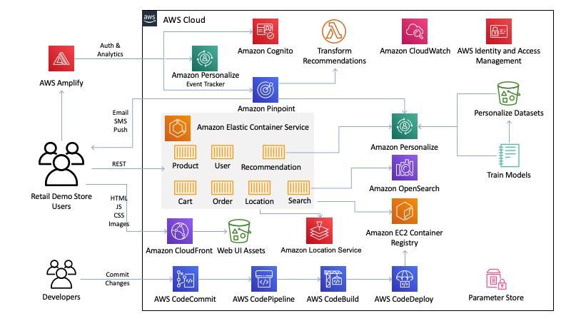

# Retail Demo Store

A sample retail web application and workshop platform intended as an educational tool for demonstrating how AWS infrastructure and services can be used to build compelling customer experiences for eCommerce, retail, and digital marketing use-cases.

**This project is intended for educational purposes only and not for production use.**

The Retail Demo Store is an eCommerce reference implementation designed to showcase how AWS services can be used to build compelling shopping experiences using modern architecture and design patterns.

At the heart of the Retail Demo Store is a collection of polyglot microservices hosted in [Amazon Elastic Container Service](https://aws.amazon.com/ecs/) ([AWS Fargate](https://aws.amazon.com/fargate/)) that represent domain constructs such as [products](../src/products), [carts](../src/carts), [orders](../src/orders), and [users](../src/users) as well as services for [search](../src/search) and [recommendations](../src/recommendations). While the [web user interface](../src/web-ui) is served by Amazon CloudFront and Amazon S3.

The architecture is supported by several managed services including [Amazon Cognito](https://aws.amazon.com/cognito/), [Amazon Pinpoint](https://aws.amazon.com/pinpoint/), [Amazon Personalize](https://aws.amazon.com/personalize/), and [Amazon Elasticsearch Service](https://aws.amazon.com/elasticsearch-service/). The [web user interface](../src/web-ui]) is built using the [Vue.js](https://vuejs.org/) framework with [AWS Amplify](https://aws.amazon.com/amplify/) to provide integrations with Cognito for registration/authentication and event streaming to Pinpoint and Personalize (Event Tracker). Finally, [AWS CodePipeline](https://aws.amazon.com/codepipeline/) is leveraged to demonstrate how AWS development services can be used to orchestrate the build and deployment process with the Retail Demo Store.

## Hands-On Workshops

This project is designed to provide you with an environment in which you can learn to use AWS services to modify the behavior of an ecommerce application, based on business requirements. This can be done in a group setting or as an individual using self-paced workbooks. Currently there are workshops for adding search, personalization, experimentation frameworks, a/b testing, analytics, customer data platforms (CDPs), messaging, and more.

In order to use the workshops, you will need to deploy the Retail Demo Store into an AWS account, using one of the methods described in the Getting Started or Developers sections below.  This is necessary because the workshops run in SageMaker Jupyter notebooks, which provide an interactive Python environment where you can execute code in the Retail Demo Store environment.

AWS Service | Workshops Overview | Workshop Links | Level | Duration
--- | --- | --- | --- | ---
 Amazon Personalize | The Retail Demo Store uses Amazon Personalize to provide similar item recommendations, search re-ranking based on user preferences, and product recommendations based on user item interactions.  The attached workshop is a throrough walk through of the major features of Amazon Personalize, and how it can be deployed in an ecommerce application like the Retail Demo Store. | [Personalize Setup](./workshop/1-Personalization/1.1-Personalize.ipynb) | 300 | 2-2.5 hours
 Amazon Pinpoint | In this workshop we will use Amazon Pinpoint to add the ability to dynamically send welcome messages, abandoned cart messages, and messages with personalized product recommendations to the customers of the Retail Demo Store. | [Email Campaigns](./workshop/4-Messaging/4.1-Pinpoint.ipynb) | 200 | 1 hour
 Amazon Lex |  In this module we're going to implement a conversational chatbot using Amazon Lex and integrate it into the Retail Demo Store's web UI. We'll provide some basic functionality to our chatbot such as being able to provide a return policy to users as well as wiring up the chatbot to the Amazon Personalize ML models we created in the Personalization workshop to provide personalized product recommendations to our users. | [Lex Chatbot](./workshop/5-Conversational/5.1-LexChatbot.ipynb) | 200 | 30 minutes
 Amazon Elasticsearch | In this workshop, you will create a new Elasticsearch Index and index the Retail Demo Store product data so that users can search for products.| [Product Search](./workshop/0-StartHere/Search.ipynb) | 200 | 20 minutes
 Amazon Location Services | Create a geofence for customers approaching your physical store and send them timely pickup notifications and offers. | [Geofencing](./workshop/7-LocationServices/7.1-LocationServices.ipynb) | 300 | 2 hours
 Amazon Alexa |  Incorporating Location Service, Personalize and Retail Demo Store into a hands-free ordering experience. | [Alexa skill deployment](./workshop/5-Conversational/5.2-AlexaHandsfree.md) | 300 | 60 minutes
Experimentation | In this module we are going to add experimentation to the Retail Demo Store. This will allow us to experiment with different personalization approaches in the user interface. Through notebooks in this module we will demonstrate how to implement three experimentation techniques. | [Overview](./workshop/3-Experimentation/3.1-Overview.ipynb)    [A/B](./workshop/3-Experimentation/3.2-AB-Experiment.ipynb)    [Interleaving](./workshop/3-Experimentation/3.3-Interleaving-Experiment.ipynb)    [Multi-Armed Bandit](./workshop/3-Experimentation/3.4-Multi-Armed-Bandit-Experiment.ipynb) | 400 | 1.5 hours

## Partner Integrations

Additionally, AWS partners have developed workshop content that enable you to learn how to integrate their solutions with the Retail Demo Store and the AWS services that it relies on, such as Amazon Personalize.

AWS Partner | Workshops Overview | Workshop Links | Level | Duration
--- | --- | --- | --- | ---
 | In this workshop, you will set up tracking for [Amplitude](https://amplitude.com/) events, analyze user behavior prior to peronalization being deployed, and then measure the effects of personalization on user behavior after Personalize is deployed in the Retail Demo Store. | [Evaluating Personalization Performance](./workshop/3-Experimentation/3.5-Amplitude-Performance-Metrics.ipynb) | 200 | 30 minutes
 | In this workshop we will use [Braze](https://www.braze.com/) to add the ability to personalize marketing messages to customers of the Retail Demo Store using customer behavioral data and the Personalize models you trained when setting up Amazon Personalize. | [Personalized Email Campaigns](./workshop/4-Messaging/4.2-Braze.ipynb) | 200 | 1 hour
 | [mParticle](https://mparticle.com/) is a Customer Data Platform that allows any brand to ingest data from multiple sources in real-time, apply data quality and governance over the ingested data and orchestrate the data to any marketing and technology stack your organization is using.  In this workshop, you will configure real-time event flows to Amazon Personalize using the mParticle SDKs and then use that data to create customer profiles that can be used in marketing campaigns to customers via Braze. | [Real Time Personalization Events](./workshop/1-Personalization/1.2-Real-Time-Events-mParticle.ipynb)    [Personalized Customer Profiles and Messaging with any marketing tool (Braze) and mParticle](./workshop/6-CustomerDataPlatforms/6.2-mParticle.ipynb) | 300 | 1-1.5 hours
 | In this exercise we will define, launch, and evaluate the results of an A/B experiment of a personalized user experience using [Optimizely](https://www.optimizely.com/). | [AB Experiments for Personalization](./workshop/3-Experimentation/3.6-Optimizely-AB-Experiment.ipynb) | 200 | 30 minutes
 | [Segment](https://segment.com/) is a real-time events pipeline for customer data, as well as a customer data platform.  In the Retail Demo Store, Segment is used to deliver real-time events from the web user interface to Amazon Personalize.  These real-time events are also used to create customer profile with Amazon Personalize recommendations appended, which can then be used via the CDP to push data to marketing tools. | [Real Time Personalization Events](./workshop/1-Personalization/1.2-Real-Time-Events-Segment.ipynb)    [Customer Data Platforms and Personalize](./workshop/6-CustomerDataPlatforms/6.1-Segment.ipynb) | 300 | 1-1.5 hours

## Supported Regions

The Retail Demo Store has been tested in the AWS regions indicated in the deployment instructions below. Additional regions may be supported depending on [service availability](https://aws.amazon.com/about-aws/global-infrastructure/regional-product-services/) and having the Retail Demo Store's deployment resources staged to an S3 bucket in the targeted region.

# Getting Started

***IMPORTANT NOTE:** Deploying this demo application in your AWS account will create and consume AWS resources, which will cost money. In addition, some features such as account registration via Amazon Cognito and the messaging workshop for Amazon Pinpoint require users to provide a valid email address and optionally a phone number to demonstrate completely. Therefore, to avoid ongoing charges and to clean up all data, be sure to follow all workshop clean up instructions and shutdown/remove all resources by deleting the CloudFormation stack once you are finished.*

**The Retail Demo Store experience is for demonstration purposes only. You must comply with all applicable laws and regulations, including any laws and regulations related to email or text marketing, in any applicable country or region.**

**If you are a developer looking to contribute to the Retail Demo Store, please see the Developer section below.**

To get the Retail Demo Store running in your own AWS account, follow these instructions. If you are attending an AWS-led event where temporary AWS accounts are provided, this has likely already been done for you. Check with your event administrators.

## Step 1 - Get an AWS Account

If you do not have an AWS account, please see [How do I create and activate a new Amazon Web Services account?](https://aws.amazon.com/premiumsupport/knowledge-center/create-and-activate-aws-account/)

## Step 2 - Log into the AWS Console

Log into the [AWS console](https://console.aws.amazon.com/) if you are not already.

Note: If you are logged in as an IAM user, ensure your account has permissions to create and manage the necessary resources and components for this application.

## Step 3 - Deploy to your AWS Account

The following CloudFormation launch options will set the deployment approach to "CodeCommit". You can ignore the GitHub related template parameters. After clicking one of the Launch Stack buttons below, follow the procedures to launch the template.

With this deployment option, the CloudFormation template will import the Retail Demo Store source code into a CodeCommit repository in your account and setup CodePipeline to build and deploy into ECS from that respository.

Region name | Region code | Launch
--- | --- | ---
US East (N. Virginia) | us-east-1 | 
US West (Oregon) | us-west-2 | 
Europe (Ireland) | eu-west-1 | 
Asia Pacific (Tokyo) | ap-northeast-1 | 
Asia Pacific (Sydney) | ap-southeast-2 | 

The CloudFormation deployment will take 20-30 minutes to complete.

### Notes:

#### Amazon Personalize Campaigns

If you chose to have the Amazon Personalize campaigns automatically built post-deployment, this process will take an additional 2-2.5 hours. This process happens in the background so you don't have to wait for it to complete before exploring the Retail Demo Store application and architecture. Once the Personalize campaigns are created, they will be automatically activated in the [Web UI](src/web-ui) and [Recommendations](src/recommendations) service. You can monitor the progress in CloudWatch under the `/aws/lambda/RetailDemoStorePersonalizePreCreateCampaigns` log group.

#### Amazon Pinpoint Campaigns
If you chose to have the Amazon Pinpoint campaigns automatically built (‘Auto-Configure Pinpoint’ is set to ‘Yes’ in the CloudFormation template), this process will take an additional 20-30 minutes.
Once the Pinpoint campaigns are created, they will be automatically visbile in the [Web UI](src/web-ui). However, there are some manual steps described below that are required for enabling the Pinpoint channels.

##### Pinpoint Emails:

*PinpointEmailFromAddress:*
By Default, AWS Accounts have  [emails set up in a sandbox environement](https://docs.aws.amazon.com/pinpoint/latest/userguide/channels-email.html). To enable the functionality, you need to complete either of the following manual steps.
* Verifying the email addresses you want to send and receive emails from. More info [here](https://docs.aws.amazon.com/pinpoint/latest/userguide/channels-email-manage-verify.html). This is the easiest and recommended approach for demos and workshops.
* Request to be removed from the sandbox environment. More info [here](https://docs.aws.amazon.com/pinpoint/latest/userguide/channels-email-setup-production-access.html). This is recommended only for production workloads and the Retail Demo Store is intended to be used for demonstration purposes only.

##### Pinpoint SMS
*PinpointSMSLongCode:*
A dedicated [long code](https://docs.aws.amazon.com/pinpoint/latest/userguide/channels-sms-awssupport-long-code.html) (i.e. a phone number) obtained for Amazon Pinpoint to send and receive messages at. You also need to enable [two way SMS](https://docs.aws.amazon.com/pinpoint/latest/userguide/channels-sms-two-way.html) for this long code using Pinpoint. Follow steps 2 and 3 in the *Enable Pinpoint SMS Channel & Obtain Dedicated Long Code* section of the [Pinpoint workshop](https://github.com/aws-samples/retail-demo-store/blob/master/workshop/4-Messaging/4.1-Pinpoint.ipynb) to get a long code and enable two way SMS for it.
When deploying Retail Demo Store, enter the number as a parameter. The number should be formatted along with the country code and without any spaces or brackets. For Example: enter “+1XXXXXXXXXX” for a long code based in the United States.

## Step 4 - Using the Retail Demo Store Web Application

Once you launch the CloudFormation stack, all of the services will go through a build and deployment cycle and deploy the Retail Demo Store.

Compiling and deploying the web UI application and the services it uses can take some time. You can monitor progress in CodePipeline. Until this completes, you may see a Sample Application when accessing the public WebUI URL.

You can find the URL for the Retail Demo Store Web UI in the Outputs of your main CloudFormation stack (called `retaildemostore` unless you changed that option in the steps above).

Look for the "WebURL" output parameter.

You can read more [detailed instructions on how to demo the Retail Demo Store in the Demo section at the end of this document](#delivering-a-demo-of-the-retail-demo-store).

# Accessing Workshops

The Retail Demo Store environment is designed to provide a series of interactive workshops that progressively add functionality to the Retail Demo Store application.

The workshops are deployed in a SageMaker Jupyter environment that is deployed in your CloudFormation stack.  To access the Retail Demo Store workshops after the CloudFormation stack has completed, browse to Amazon SageMaker in your AWS console, and then select "Notebook > Notebook instances" in SageMaker.

You will see a running Notebook instance. Click "Open JupyterLab" for the Retail Demo Store notebook instance.

Here you will find several workshops in a directory structure in the notebook instance. See the [workshops](./workshop/Welcome.ipynb) page for details.

# Developer Instructions

If you're interested in contributing enhancements, features, or fixes to the Retail Demo Store, please see the [Developer Instructions](./Developer-Instructions.md) for details on how to setup your local environment and deployment environment.

# Delivering a Demo of the Retail Demo Store

Once you have deployed the Retail Demo Store, you may want to walk through the demonstration guide to learn how to show the features the Retail Demo Store provides.

The intent of the Retail Demo Store is to 1) provide a tool to demonstrate the capabilities of key AWS services for retail, eCommerce, and digital marketing use-cases and 2) provide a platform for individual AWS customers to step through workshops and AWS internal teams to deliver customer-facing workshops, Immersion Days, hackathons, and similar types of events.

1) [Creating a Retail Demo Store account](./documentation/1-Creating-account.md)
2) [Personalized Experience](./documentation/2-Personalization.md)

# Known Issues/Limitations

* The application was written for demonstration and education purposes and not for production use.
* You currently cannot deploy this project multiple times in the same AWS account and the same AWS region. However, you can deploy the project into separate supported regions within the same AWS account.
* Make sure your CloudFormation stack name uses all lowercase letters.
* Currently only tested in the AWS regions provided in the deployment instructions above. The only limitation for deploying into other regions is [availability of all required services](https://aws.amazon.com/about-aws/global-infrastructure/regional-product-services/).
    - Amazon IVS is currently only supported in the N. Virginia (us-east-1), Oregon (us-west-2), and Ireland (eu-west-1) regions. Therefore, to deploy the Retail Demo Store in a region that does not support IVS, be sure to select to use the Default IVS Streams CloudFormation template parameter.

# Reporting Bugs

If you encounter a bug, please create a new issue with as much detail as possible and steps for reproducing the bug. See the [Contributing Guidelines](./CONTRIBUTING.md) for more details.

# License

This sample code is made available under a modified MIT license. See the LICENSE file.
