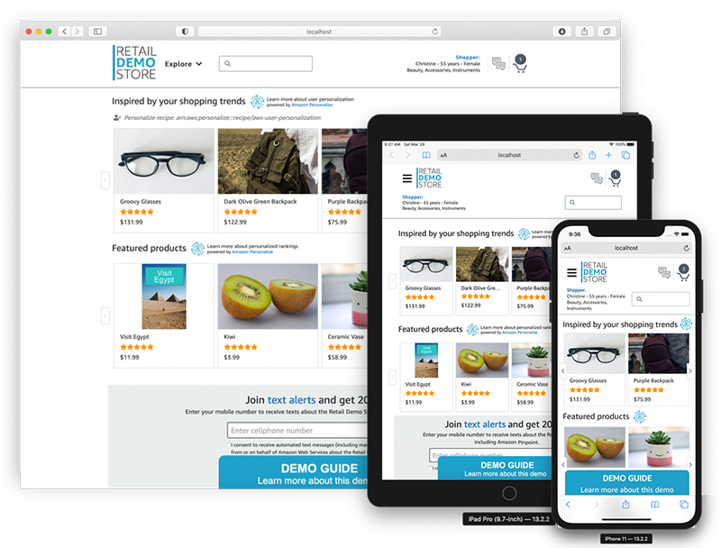

# Retail Demo Store

A sample retail web application and workshop platform intended as an educational tool for demonstrating how AWS infrastructure and services can be used to build compelling customer experiences for eCommerce, retail, and digital marketing use-cases.

**This project is intended for education purposes only and not for production usage.**



The core of the Retail Demo Store is a polyglot microservice architecture deployed as a collection of RESTful web services in [Amazon Elastic Container Service](https://aws.amazon.com/ecs/) (ECS). Several AWS managed services are leveraged to provide build, deployment, authentication, messaging, search, and personalization capabilities. The web user interface is a [single page application](https://en.wikipedia.org/wiki/Single-page_application) built using [responsive web design](https://en.wikipedia.org/wiki/Responsive_web_design) frameworks and techniques, producing a native app-like experience tailored to the user's device. See the [workshops](./workshop/Welcome.ipynb) page for details.


## Workshops

This project also comes with a collection of workshops that are designed to walk a technical audience, either in a group setting or self-paced as an individual, through adding enhanced functionality to the Retail Demo Store. There are workshops for adding search, personalization, an experimentation framework, user messaging, and more. For an overview of the Retail Demo Store, its architecture, and workshops, please see the [workshop welcome notebook](./workshop/Welcome.ipynb) page.

## Supported Regions

The Retail Demo Store has been tested in the AWS regions indicated in the deployment instructions below. Additional regions may be supported depending on service availability and having the Retail Demo Store's deployment resources staged to an S3 bucket in the targeted region.

## Getting Started

***IMPORTANT NOTE:** Deploying this demo application in your AWS account will create and consume AWS resources, which will cost money. In addition, some features such as account registration via Amazon Cognito and the messaging workshop for Amazon Pinpoint require users to provide a valid mobile phone number and email address to demonstrate completely. Therefore, to avoid ongoing charges and to clean up all data, be sure to follow all workshop clean up instructions and shutdown/remove all resources by deleting the CloudFormation stack once you are finished.*

To get the Retail Demo Store running in your own AWS account, follow these instructions. If you are attending an AWS-led event where temporary AWS accounts are provided, this has likely already been done for you.

1. If you do not have an AWS account, please see [How do I create and activate a new Amazon Web Services account?](https://aws.amazon.com/premiumsupport/knowledge-center/create-and-activate-aws-account/)

2. Log into the [AWS console](https://console.aws.amazon.com/) if you are not already. Note: If you are logged in as an IAM user, ensure your account has permissions to create and manage the necessary resources and components for this application.

3. Complete the instructions for the desired deployment option below.

### AWS Deployment Options

There are two options for deploying the Retail Demo Store in an AWS account. The option you choose depends on whether you just want to deploy it for evaluation or a demo or whether you're actively developing against the Retail Demo Store project.

#### Deploying for Demo or Evaluation

Choose this option if you just want to deploy the Retail Demo Store into your AWS account to try it out or for demonstration purposes. With this deployment option, the CloudFormation template will import the Retail Demo Store source code into a CodeCommit repository in your account and setup CodePipeline to build and deploy into ECS from that respository.

The following CloudFormation launch options will set the deployment approach to "CodeCommit". You can ignore the GitHub related template parameters. After clicking one of the Launch Stack buttons below, follow the procedures to launch the template.

Region name | Region code | Launch
--- | --- | ---
US East (N. Virginia) | us-east-1 | [](https://console.aws.amazon.com/cloudformation/home?region=us-east-1#/stacks/create/review?templateURL=https://s3.amazonaws.com/retail-demo-store-us-east-1/cloudformation-templates/template.yaml&stackName=RetailDemoStore&param_ResourceBucket=retail-demo-store-us-east-1&param_SourceDeploymentType=CodeCommit)
US West (Oregon) | us-west-2 | [](https://console.aws.amazon.com/cloudformation/home?region=us-west-2#/stacks/create/review?templateURL=https://s3-us-west-2.amazonaws.com/retail-demo-store-us-west-2/cloudformation-templates/template.yaml&stackName=RetailDemoStore&param_ResourceBucket=retail-demo-store-us-west-2&param_SourceDeploymentType=CodeCommit)
Europe (Ireland) | eu-west-1 | [](https://console.aws.amazon.com/cloudformation/home?region=eu-west-1#/stacks/create/review?templateURL=https://s3-eu-west-1.amazonaws.com/retail-demo-store-eu-west-1/cloudformation-templates/template.yaml&stackName=RetailDemoStore&param_ResourceBucket=retail-demo-store-eu-west-1&param_SourceDeploymentType=CodeCommit)

The CloudFormation deployment will take 20-30 minutes to complete. If you chose to have the Amazon Personalize campaigns automatically built post-deployment, this process will take an additional 2-2.5 hours. However, this process happens in the background so you don't have to wait for it to complete before exploring the Retail Demo Store application and architecture. Once the Personalize campaigns are created, they will be automatically activated in the [Web UI](src/web-ui) and [Recommendations](src/recommendations) service. You can monitor the progress in CloudWatch under the `/aws/lambda/RetailDemoStorePersonalizePreCreateCampaigns` log group.

#### Deploying for Development

Choose this option if you want to contribute an enhancement/fix back to the Retail Demo Store project. The CodePipeline configuration will be setup to pull from your GitHub fork of this repository so that commits to your fork will be automatically deployed to the Retail Demo Store services in your AWS account.

1. If not already done so, fork the Retail Demo Store respository into your own GitHub account.
2. Create a [GitHub Personal Access Token](https://help.github.com/en/articles/creating-a-personal-access-token-for-the-command-line) in your GitHub account. Be sure that your token has the "repo", "repo:status", and "admin:repo_hook" permission scopes. Save your access token in a secure location.
3. Select one of the CloudFormation launch options below. The deployment approach will be set to "GitHub". **All GitHub related template parameters are required.** After clicking one of the Launch Stack buttons below, follow the procedures to launch the template.

Region name | Region code | Launch
--- | --- | ---
US East (N. Virginia) | us-east-1 | [](https://console.aws.amazon.com/cloudformation/home?region=us-east-1#/stacks/create/review?templateURL=https://s3.amazonaws.com/retail-demo-store-us-east-1/cloudformation-templates/template.yaml&stackName=RetailDemoStore&param_ResourceBucket=retail-demo-store-us-east-1&param_SourceDeploymentType=GitHub)
US West (Oregon) | us-west-2 | [](https://console.aws.amazon.com/cloudformation/home?region=us-west-2#/stacks/create/review?templateURL=https://s3-us-west-2.amazonaws.com/retail-demo-store-us-west-2/cloudformation-templates/template.yaml&stackName=RetailDemoStore&param_ResourceBucket=retail-demo-store-us-west-2&param_SourceDeploymentType=GitHub)
Europe (Ireland) | eu-west-1 | [](https://console.aws.amazon.com/cloudformation/home?region=eu-west-1#/stacks/create/review?templateURL=https://s3-eu-west-1.amazonaws.com/retail-demo-store-eu-west-1/cloudformation-templates/template.yaml&stackName=RetailDemoStore&param_ResourceBucket=retail-demo-store-eu-west-1&param_SourceDeploymentType=GitHub)

The CloudFormation deployment will take 20-30 minutes to complete. If you chose to have the Amazon Personalize campaigns automatically built post-deployment, this process will take an additional 2-2.5 hours. However, this process happens in the background so you don't have to wait for it to complete before exploring the Retail Demo Store application and architecture. Once the Personalize campaigns are created, they will be automatically activated in the [Web UI](src/web-ui) and [Recommendations](src/recommendations) service. You can monitor the progress in CloudWatch under the `/aws/lambda/RetailDemoStorePersonalizePreCreateCampaigns` log group.

## Accessing Web UI

Once you launch the CloudFormation stack using one of the deployment options above, all of the services will go through a build and deployment cycle and deploy the Retail Demo Store. This can take a few minutes and you can monitor progress in CodePipeline. Until this completes, you may see a Sample Application when accessing the public WebUI URL.

You can find the URL for the Retail Demo Store Web UI in the Outputs of your CloudFormation stack. Look for the "WebURL" output.

You can read more detailed instructions on how to use this demo in the [demonstration documentation](documentation).

## Accessing Workshops

To access the Retail Demo Store workshops after the CloudFormation stack has completed, browse to Amazon SageMaker and then Notebook instances in the AWS console in your AWS account. You will see a running Notebook instance. Click "Open JupyterLab" for the Retail Demo Store notebook instance. You will find several workshops in a directory structure in the notebook instance. See the [workshops](./workshop/Welcome.ipynb) page for details.

## Developing Locally

If you are interested in running Retail Demo Store services locally as part of contributing a fix or enhancement, we have [detailed instructions](./src) on how to get up and going quickly.

### Working with CloudFormation Templates

***These instructions only apply if you wish to stage your own Retail Demo Store deployment resources. For example, if you want to test CloudFormation template changes or the deployment of Lambda code. These instructions are not necessary for the typical deployment scenarios described above.***

The launch options described above pull the CloudFormation templates from a shared S3 bucket. If you want to test changes to the templates or launch a custom variation of this project, you can do so by uploading your versions of the templates and other deployment resources to an S3 bucket in your account (i.e. staging), launching your version of the [root template](aws/cloudformation-templates/template.yaml) (i.e. upload the root template or specify an S3 URL pointing to the root template in your bucket), and override the "ResourceBucket" and "ResourceBucketRelativePath" template parameters to refer to your bucket and path. These parameters are used to load the nested templates from your bucket rather than the default shared bucket.

The [stage.sh](stage.sh) script at the root of the repository can be used to upload the deployment resources to a staging S3 bucket. The shell uses the local AWS credentials to build and push resources to your custom bucket. Once staged, you can follow one of the deployment options above.

Example on how to stage your project to a custom bucket and path (note the path is optional but, if specified, must end with '/'):

```bash
./stage.sh mycustombucket path/
```

## Known Issues

* The application was written for demonstration purposes and not for production use.
* Currently only tested in the AWS regions provided in the deployment instructions above.

## Reporting Bugs

If you encounter a bug, please create a new issue with as much detail as possible and steps for reproducing the bug. See the [Contributing Guidelines](./CONTRIBUTING.md) for more details.

## License Summary

This sample code is made available under a modified MIT license. See the LICENSE file.
