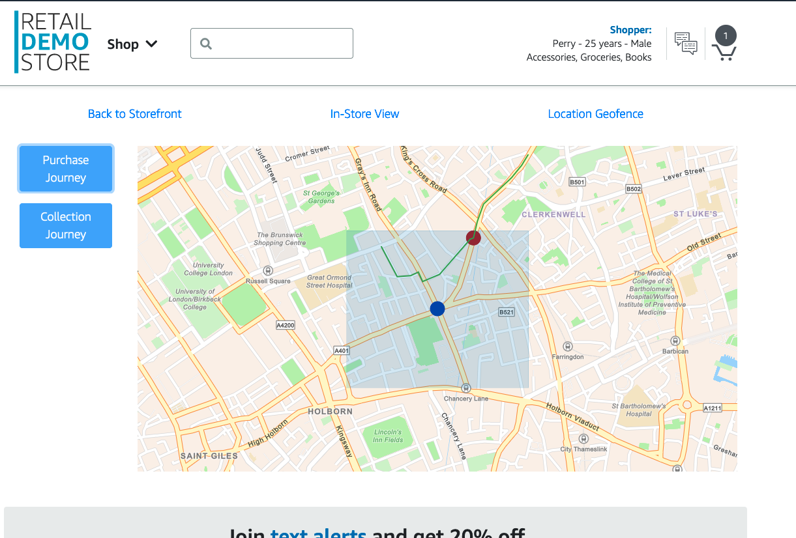

## Geofencing and Location-aware Personalization

The Retail Demo Store integrates Amazon Location Services to demonstrate how businesses can leverage location data to deliver personalized experiences and increase foot traffic to physical stores.

### Use Case

Imagine a customer is out shopping and approaches one of your retail locations. As they get closer, you want to be able to detect their presence, deliver a personalized offer or notification, and potentially encourage them to come into the store to redeem the offer or pick up an online order.

### How it Works

The Retail Demo Store uses Amazon Location Services to set up a geofence around a sample physical store location. As customers approach the store, their location is detected, and personalized messages are delivered to them through Amazon Pinpoint.

The key components are:

1. **Location Service**: Defines the geofence around the physical store and tracks customer proximity.
2. **Offers Service**: Maintains a catalog of personalized offers that can be triggered based on customer location.
3. **Pinpoint**: Sends personalized push notifications, SMS, or email messages to customers when they enter the geofence.
4. **Personalize**: Integrates with Amazon Personalize to select the most relevant offer for each customer based on their profile and past behaviors.

When a customer enters the geofence, the following happens:

1. The Location Service detects the customer's proximity to the store.
2. The Offers Service selects a personalized offer for the customer using Amazon Personalize.
3. Pinpoint delivers the personalized offer to the customer via their preferred communication channel (e.g., push notification, SMS, email).
4. The customer can then redeem the offer by visiting the store.

### Benefits

- **Increased Foot Traffic**: Personalized offers and notifications encourage customers to visit the physical store.
- **Improved Customer Experience**: Customers receive timely, relevant offers based on their location and preferences.
- **Enhanced Omni-Channel Strategy**: Integrating location data with other customer data (e.g., purchase history, browsing behavior) enables a more comprehensive, personalized customer experience across digital and physical channels.

### Try it Yourself

To experience the Geofencing and Location-aware Personalization demo, deploy the Retail Demo Store and navigate to the "In Store View -> Location Geofence" section. You can then simulate a customer approaching the store and see the personalized offer delivered.