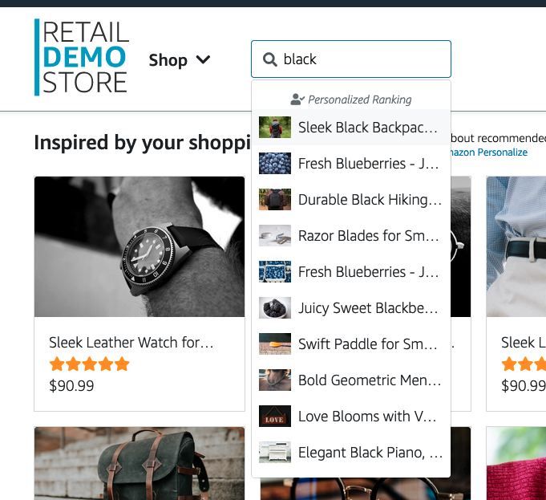

# Product search

The Search demo in the Retail Demo Store showcases how to integrate Amazon OpenSearch Service (formerly Amazon Elasticsearch Service) to provide a powerful and customizable search experience for an ecommerce application.

The current demo presents only type-ahead search at the moment, but the principles could be extended to support a fully fledged search solution.

## How it Works

The core components of the Search demo are:

1. **Search Service**: This is a RESTful web service that provides an API for querying the product catalog and returning search results. The service is deployed as a Docker container on Amazon ECS.

2. **OpenSearch Cluster**: Amazon OpenSearch Service is used to host the product index and power the search functionality. When the Retail Demo Store is initially deployed, the product catalog is automatically indexed in OpenSearch.

3. **Web UI Integration**: The Retail Demo Store's web user interface makes calls to the Search Service API when a user performs a search. The search results are then displayed to the user.

Here's a step-by-step breakdown of how the Search demo works:

1. **User Initiates a Search**: A user enters a search query in the Retail Demo Store's web UI.
2. **Web UI Calls Search Service**: The web UI makes a request to the Search Service API, passing the user's search query.
3. **Search Service Queries OpenSearch**: The Search Service forwards the query to the OpenSearch cluster and retrieves the relevant product results.
4. **Search Service rerank the results**: The Search Service send the results to Amazon Personalize to rerank based on the current customer.
5. **Web UI Displays Results**: The web UI receives the search results and displays them to the user.

## Conclusion

The Search demo in the Retail Demo Store showcases how to leverage Amazon OpenSearch Service to provide a scalable, customizable, and integrated search experience for an ecommerce application. By combining the power of OpenSearch with the overall architecture of the Retail Demo Store, businesses can deliver a highly engaging and responsive search functionality to their customers.