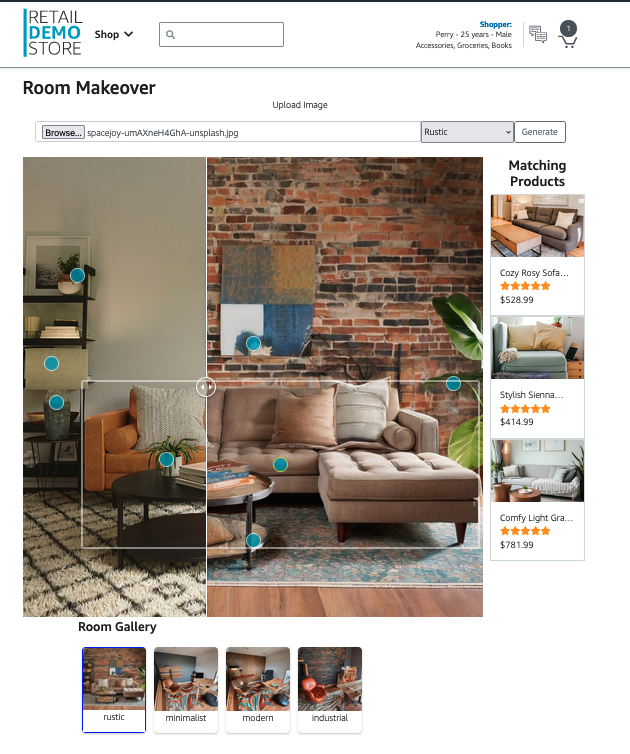

# Room Makeover: Revolutionizing Interior Design with GenAI

In today's fast-paced world, consumers are constantly seeking new and innovative ways to personalize their living spaces. The Retail Demo Store's Room Makeover demo harnesses the power of cutting-edge AI technologies to enable an unprecedented level of personalization in interior design.

## The Challenge

Traditionally, the process of reimagining a room's décor has been time-consuming and labor-intensive. Homeowners often struggle to visualize how different design elements would look in their existing spaces, leading to hesitation and missed opportunities.

## The Solution

The Room Makeover demo revolutionizes this experience by seamlessly integrating several AWS services to create a truly immersive and personalized interior design solution.

1. **User Uploads Room Image**: Customers can upload a photo of their existing room through a secure and intuitive web interface powered by AWS Amplify and Amazon Cognito.

2. **Image Analysis**: The uploaded image is then analyzed using Amazon Rekognition, which detects and identifies the key furniture and decor elements within the room.

3. **Product Matching**: The detected objects are matched against a product catalog using Amazon Bedrock's Titan Multimodal Embeddings model, which provides a rich understanding of product attributes and similarities.

4. **Personalized Prompts**: Combining the detected room elements with the product matches, the demo generates a personalized prompt that can be used to guide the AI-powered room redesign.

5. **Stable Diffusion Generation**: The prompt is then passed to a custom Stable Diffusion model deployed on Amazon SageMaker, which generates a new image depicting the room in the selected design style.

6. **Continuous Optimization**: The generated image is further analyzed to identify additional furniture and decor elements, which are matched back to the product catalog to allow customers to select and purchase straight from the generated room image.

## The Benefits

The Room Makeover demo offers several key benefits for businesses and consumers:

1. **Personalization at Scale**: By leveraging the power of AI, the demo can generate personalized room designs for each customer, at scale, rather than relying on manual, labor-intensive processes.

2. **Increased Engagement and Conversion**: The immersive, AI-powered experience helps customers visualize how their spaces could be transformed. The generated product in the image is automatically linked to the product catalog and features a direct "add to basket" functionality, driving increased engagement and ultimately, higher conversion rates. 

3. **Streamlined Workflows**: The automated product matching and prompt generation capabilities reduce the time and effort required by interior design professionals, enabling them to focus on higher-value tasks.

## Conclusion

The Room Makeover demo showcases the transformative potential of AI-powered personalization in the interior design industry. By seamlessly integrating cutting-edge AWS services, businesses can now offer their customers a truly innovative and engaging experience, ultimately driving growth and customer satisfaction.