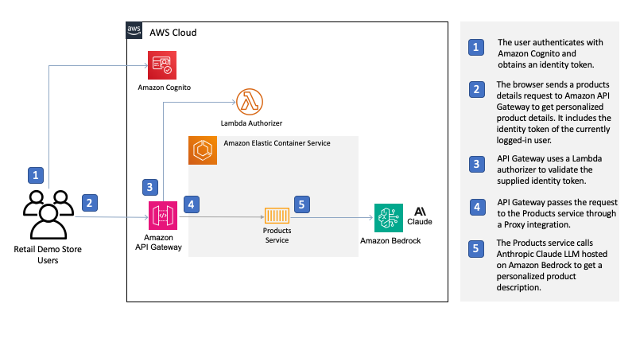

# Personalized Product Descriptions

Generative AI can be used to automate the creation of marketing content. This includes generating text for blogs, social media posts, and emails, as well as creating images and videos. 
This can save marketers a significant amount of time and effort, allowing them to focus on other aspects of their marketing strategy. 


Where it really shines is the ability to productionize marketing content creation, reducing the needs for marketers to create multiple copies for different customer segments. 
Previously, marketers would need to generate many different copies for each granularity of customers (e.g. attriting customers who are between the age of 25-34 and loves food). 
Generative AI can automate this process, providing the opportunities to dynamically create these contents.

This demo integrates the product service with Amazon Bedrock, to retrieve personalized product descriptions based on the logged-in user's age and interests.  
Amazon Bedrock makes Foundation Models (FMs) accessible via an API, and in this demo,  Anthropic Claude v2 is the underlying FM used.

The prompt used to generate personalised product descriptions takes the following form:

```
  I'd like you to rewrite the following paragraph using the following instructions:
  "{instructions}"

  "{original product description}"

  Please put your rewrite in &lt;p>&lt;/p> tags.
```


The instructions used are:


```
Please generate an enhanced product description personalised for a customer aged {age range}, interested in {interests}.
However, do not mention their age in the rewrite.
The product is named "{product name}" and is a product of type "{product type}" in the {product category} category.
```



  


