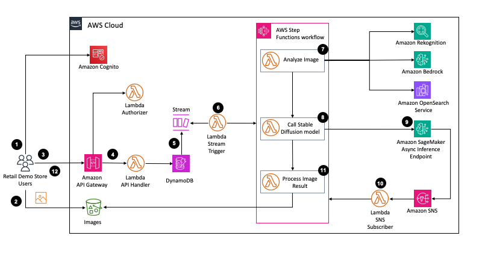
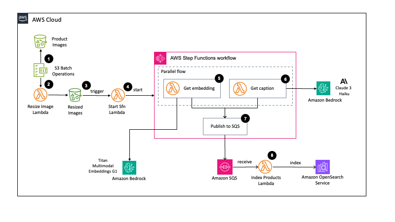

# Room Makeover

Imagine being able to instantly re-imagine a room in different decor styles. 
This demo combines Stable Diffusion, Amazon Sagemaker, Amazon Bedrock and Amazon Rekognition to enable an innovative approach to generating re-styled rooms from an initial user uploadedimage.
  


1. The user authenticates with Amazon Cognito and obtains an identity token. This is passed through to all subsequent API requests to the API Gateway.
1. User selects a room image through the browser and the Web UI uses AWS Amplify Storage module to upload to S3.
2. The Web UI calls the API Gateway, passing in the S3 location of the uploaded image and the selected room style, to create a room generation request. A unique id is returned that can beused to retrieve the results.
3. The API Gateway uses a Lambda authorizer to validate the supplied identity token. It then proxies the request through to a Lambda function that validates and then persists the requestinto DynamoDB.
4. DynamoDB streams captures the newly inserted room request.
5. A lambda function triggers on each new record in the stream and starts an AWS Step Function to process the request.
6. The first step of the step function performs image analysis on the uploaded room image. The output of the step is a prompt that can passed to the Stable Diffusion model.
    * Amazon Rekognition is used to detect objects in the image – such as sofa’s, chairs, and tables. It returns a list of objects, together with their associated bounding boxes.
    * For each object detected, a cropped image is created using the bounding box coordinates.
    * Each image is then converted into a base64 string and sent as a request to Amazon Bedrock to use the Titan Multimodal Embeddings G1 model to obtain an embedding representation of the image.
    * For each embedding, a K-NN request is made to the Amazon OpenSearch service to obtain the closest product matches. The product match will also contain a caption – pre-generated by  Anthropic’s Claude 3 Haiku model. The caption was generated by passing the product and prompting Claude 3 to describe what’s in the picture.
    * To create the final prompt, an initial base prompt is looked up using the style selected by the customer, which is then combined with the top matching product’s captions using [prompt  weighting](https://huggingface.co/docs/diffusers/main/en/using-diffusers/weighted_prompts).
7. The uploaded room image and prompt are sent to the SageMaker Asynchronous Inference Endpoint. The Step Function pauses at this point until the inference process completes – implementedusing a callback [task token](https://docs.aws.amazon.com/step-functions/latest/dg/connect-to-resource.html#connect-wait-token).
8. The SageMaker Endpoint is deployed as a [HuggingFace Deep Learning Container](https://docs.aws.amazon.com/sagemaker/latest/dg/hugging-face.html), which hosts a custom Stable Diffusion model that uses ControlNet to add depth conditioning of the uploadedimage to 1. the generation. When the model completes the inference process, it places the result in an S3 bucket and sends a notification to an Amazon SNS topic containing the location ofthe result 1. payload.
9. Amazon SNS invokes the Lambda function that is subscribed to the topic. The Lambda function calls-back into the Step Function to resume the process.
10. The final step of the Step Function loads the inference result, extracts the generated image, and places it in the bucket for the customer to access. The final image is also  re-analyzedfollowing the process in step 7, so that new bounding boxes and similar products are retrieved.
11. The Web UI has been polling the API Gateway using the unique ID obtained from the initial request. The room generation response is updated throughout the process. A done state is returned, together with a reference to the final room image, which indicates to the frontend to render the results. The Amplify Storage API is used to generate a signed URL, so that theimage can be  downloaded from S3.

## Pre-processing the product images

The first step of the step function performs image analysis on the uploaded room image.  The output of the step is a prompt that can passed to the Stable Diffusion model.




1. A S3 Batch Operations Job executes on the product images bucket and triggers a Lambda function for each image.
1. Lambda function resizes the product image and places resulting image in separate bucket.
1. Lambda function triggers on S3 create event in bucket.
1. Lambda function starts execution of express workflow to process image.
1. Embedding for image are retrieved using Titan Multimodal Embeddings model through Amazon Bedrock.
1. Product captions – descriptions of what the product image contains – are created by calling Anthropic Claude 3 Haiku model through Amazon Bedrock.
1. Embedding and caption are published to SQS.
1. Lambda function receives batches of captions & embeddings and indexes them into Amazon OpenSearch.

The prompt used with the Claude 3 Haiku model to generate the product captions was as follows:

```
Identify the {category} product in the image. Then identify the dominant color or colours of the {category} product. Be descriptive. Ignore the background. Name the product and then describe it without any preamble.
&lt;example&gt;Sofa, deep, plush green color with a smooth, velvet-like texture. It features a rectangular shape with a modern, streamlined silhouette and two cylindrical cushions at either end, serving as armrests. The sofa has three seat cushions that create a single seating surface without separations, and the back cushion runs the length of the sofa in a single piece as well, contributing to its sleek design. There are no visible patterns or prints on the fabric, which gives it a rich, uniform look. The sofa's legs are short, cylindrical, and appear to be made of light-colored wood&lt;/example&gt;
```
