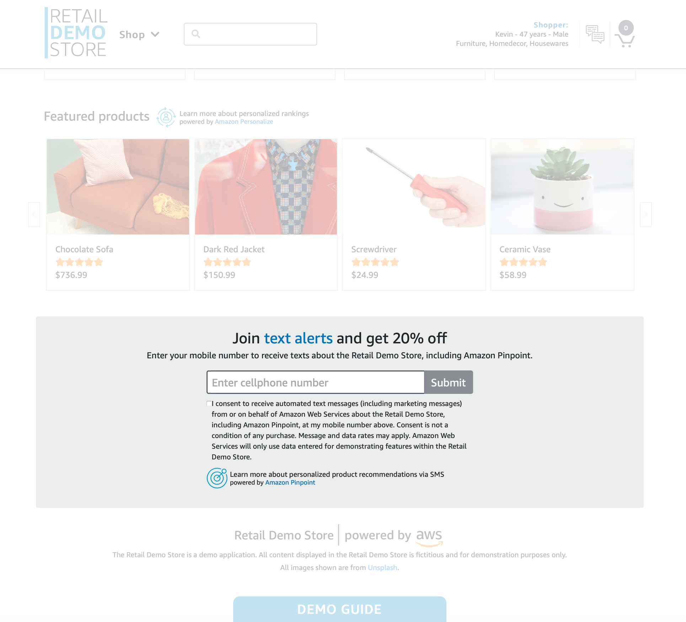

  
# Text Messaging (SMS): Personalized Alerts and Promotions

Amazon Pinpoint has deep configuration options for SMS (text) messaging and can deliver messages to every country
in the world. Retail / eCommerce organizations have many use cases for text messaging - including transactional
uses like purchase confirmations and marketing uses like promotions. These messages can be augmented with data
output from ML services like Amazon Personalize for Personalization, Recommendations, Next-Best-Actions, among
other use cases. User attributes from Amazon Personalize can be selected within the Amazon Pinpoint console or API
in order to personalize the content of templates in real-time. Importantly, this enables organizations to deliver
a unified, omni-channel personalization experience.

This demo showcases personalized product recommendation via text message. Try this feature by opting-in to receive
text alerts.

## Enable SMS sending for the USA.
  
In the USA it is a legal requirement that you subscribe to a phone number or
long code in order to be able to send text messages and receive them.
If you have not followed the Pinpoint messaging workshop to enable
messaging, but you set "Auto-Configure Pinpoint" to "Yes" when you deployed
the demo, you are almost set up. The following steps show how you can finish set-up:
  
1. Subscribe to a long-code or phone number that supports SMS through the Pinpoint UI so that Pinpoint has a number to send messages from.
    1. Go to your Pinpoint AWS console in the region into which Retail Demo Store is deployed.
    1. Choose "Settings ... SMS" or "Settings... Voice and SMS"
    1. Click "Request phone number", choosing "United States" for the country.
    1. Ensure the number type is "Toll-free" and that "SMS" option is checked.
    1. Click "Next" then "Request".
1. Enable two-way SMSs to enable Retail Demo Store to receive messages sent to the dedicated number and opt in users.
    1. Go back to "Settings ... SMS" or "Settings... Voice and SMS"
    1. Click on your newly registered phone number under "Number settings"
    1. Expand "Two-way SMS" and click "Enable two-way SMS".
    1. Under "Incoming messages destination" click "Choose an existing SNS topic" and choose the topic that contains the text "PinpointIncomingTextAlertsSNSTopic" which was put there by CloudFormation when you deployed your store. 
1. Tell Retail Demo Store about the phone number you have acquired.
    1. So that Retail Demo Store can make use of the dedicated number you acquired above, take note of the number and navigate to Systems Manager AWS console in the region Retail Demo Store is deployed.
    1. Find the parameter named "retaildemostore-pinpoint-sms-longcode" and click on "edit", then enter the value for your dedicated the phone number (including the country code as in `+11234567890`). You may also enter this information when deploying Retail Demo Store with CloudFormation.

## Opt in for text alerts.

The home page, shopping cart page and every product page in the store include a field to opt-in. Enter the mobile phone number where you’d like to receive the one-time automated marketing message.

You will receive a text message to confirm the subscription. Reply “Y” to confirm. Upon confirmation, you’ll receive a 20% discount code.

Next, you’ll receive one text message with one personalized product recommendation. The message will include a URL that will redirect you to the Retail Demo Store

  

