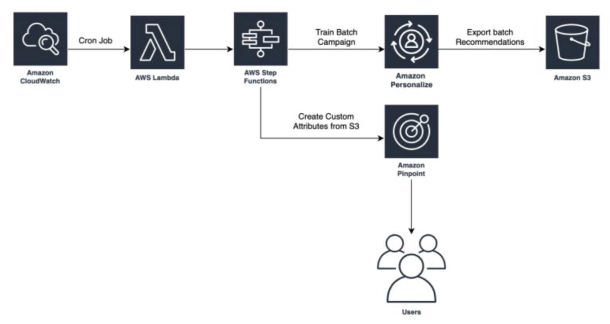

While real-time recommendations are highly recommended, Amazon Personalize does support batch recommendations.
Batch recommendations let you generate personalized recommendations for a large number of users, or similar items
for a large number of items, in one go, and then use them in batch processes, such as sending emails or
notifications.

## AWS News Blog

[Batch Recommendations in Amazon Personalize](https://aws.amazon.com/blogs/aws/now-available-batch-recommendations-in-amazon-personalize/)

