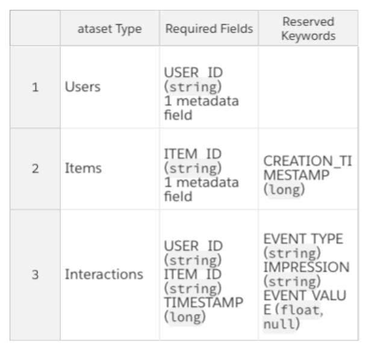

  
# What data should I provide?

Amazon Personalize recognizes three types of historical data:

* Users – This data is intended to provide information about your users such as age, gender, or loyalty membership
which can be important signals in personalization systems.
* Items – This data is intended to provide information about your items, such as their description, price, SKU type, or
  availability. In the case of unstructured text such as product descriptions, Personalize will use ML-based
  natural language processing (NLP) to extract key information about your products to provide more relevant recommendations.
* Interactions – This data is historical interactions between users and items. It can also provide information on
  your user's browsing context, such as their location or device (mobile, tablet, desktop, and so on).

The user and item data are metadata types and only used in certain use cases. Please see [the documentation](https://docs.aws.amazon.com/personalize/latest/dg/how-it-works-dataset-schema.html)
for further technical details.

Each type of data that Amazon Personalize recognizes has required fields, reserved keywords and datatypes. Please
see table below for details.

Amazon Personalize will train and deploy a model based on this data. Developers can then use a simple inference
API to get individualized recommendations at run-time and generate a personalized experience for the end users
according to the type of personalization model (e.g. user personalization, similar items or personalized
rankings). Amazon Personalize works best for large datasets that have over 50 users, 50 items, and 1500
interactions.

  

