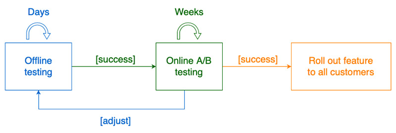

  
# Metrics and understanding impact

You can measure the performance of ML recommender systems using offline and online metrics.

Online metrics are the empirical results observed in your user’s interactions with real-time recommendations
provided in a live environment.

Offline metrics allow you to view the effects of modifying hyperparameters and algorithms used to train your
models, calculated against historical data.

Amazon Personalize generates offline metrics using test datasets derived from the historical data you provide.
These metrics showcase how the model recommendations performed against historical data. Offline metrics are a
great representation of how your hyperparameters and data features influence your model’s performance against
historical data. To find empirical evidence of the impact of Amazon Personalize recommendations on your business
metrics, such as click-through rate, conversion rate, or revenue, you should test these recommendations in a live
environment, getting them in front of your customers.

## AWS Machine Learning Blog

[Using A/B testing to measure the efficacy of recommendations generated by Amazon Personalize](https://aws.amazon.com/blogs/machine-learning/using-a-b-testing-to-measure-the-efficacy-of-recommendations-generated-by-amazon-personalize/)

Machine learning (ML)-based recommender systems aren’t a new concept, but developing such a system can be a
resource-intensive task—from data management during training and inference, to managing scalable real-time
ML-based API endpoints. Amazon Personalize allows you to easily add sophisticated personalization
capabilities to your applications by using the same ML technology used on Amazon.com for…

[Read more](https://aws.amazon.com/blogs/machine-learning/using-a-b-testing-to-measure-the-efficacy-of-recommendations-generated-by-amazon-personalize/)

## AWS Partner Network (APN) Blog

[Measuring the Effectiveness of Personalization with Amplitude and Amazon Personalize](https://aws.amazon.com/blogs/machine-learning/using-a-b-testing-to-measure-the-efficacy-of-recommendations-generated-by-amazon-personalize/)

  
This post will present an architecture that combines Amazon Personalize and Amplitude’s product
intelligence platform to track user behavior in real time.
  
  
It’ll also show how to deploy a sample e-commerce application in your Amazon Web Services (AWS) account,
which includes a self-guided workshop created by Amplitude to help you become familiar with its
capabilities...
  

[Read more](https://aws.amazon.com/blogs/apn/measuring-the-effectiveness-of-personalization-with-amplitude-and-amazon-personalize/)

  

  

