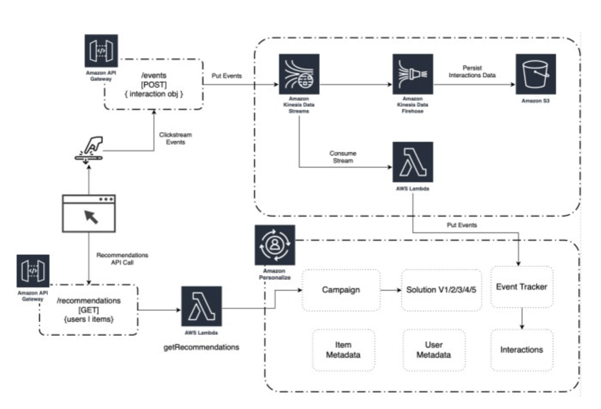

  
# Real time personalization based on real time user activity

Amazon Personalize can capture live events from your users to achieve real-time personalization. Amazon
Personalize can blend real-time user activity data with existing user profile and item information to recommend
the most relevant items, according to the user’s current session and activity.

Do you have the infrastructure in place for real-time click streaming events back into Personalize? If not, don’t
worry, we can help!

  
Build: Learn more about the AWS services available to build real-time streaming capabilities
Buy: AWS is partnering with multiple partners to translate and send your data to Amazon Personalize in the right
format.
  

## Provisioning capacity for real-time recommendations

  Customers are charged based on the transaction-per-second (TPS) capacity provisioned or used, whichever is
  greater. When creating an Amazon Personalize campaign, a customer sets their minimum TPS capacity. TPS capacity
  is measured on a TPS-hour basis (rounded up to the nearest hour). If the customer’s transaction load exceeds the
  minimum provisioned capacity, Amazon Personalize will auto-scale based on the customer’s needs. In most cases
  when a customer starts with Amazon Personalize, we recommend provisioning the minimum (1 TPS), then
  experimenting to see the impact of Personalize for users. These learnings will help inform how to scale based on
  their needs to avoid unexpected charges due to over-provisioning.

  
## Customer use case: KEEN

KEEN is a values led, independently owned outdoor footwear brand with a mission to responsibly create
original and versatile products, improve lives, and inspire outside adventure. Founded in 2003, KEEN ignited
a revolution in the footwear industry with the introduction of the Newport sandal, launching the concept of
Hybrid footwear into the market and setting KEEN on a path of driving consistent product innovation that
exists today.
  

"Over the past two years KEEN has been working to improve the way we engage our customers to bring them
increasingly relevant content for their outdoor footwear needs. Our goal is to educate our customers on the
best footwear options based on their desired outdoor activities. To really bring this capability to life we
turned to AWS and our partnership with Data in the Raw and develop a solution powered by Amazon Personalize
to use purchase and browsing history to best tailor recommendations and content for our customers along
their purchasing journey. With the initial use we looked to improve the experience for our browse abandon
customers through our email program. Initial results are encouraging, our open rates, Rev/M Sends, and Opt
out Rates were very healthy to begin with but with the implementation of Amazon Personalize we are seeing,
email CTR is up 67% over our control messaging. Rev/M Sends is up 49%, and because the content is even more
relevant, our Opt out Rate has dropped 36%. But where the rubber hits the road for me is on revenue. Test
emails have shown a 12.5% increase in revenue versus the control. It is clear that the AWS has given us
another ‘arrow in our quiver’. My only regret is this capability didn’t exist two years ago when we started
this journey."

  
## Customer use case: Data in the Raw
  

Data in the Raw helps online retailers and content producers build scalable analytics and machine learning
infrastructures. With just one JavaScript tag, Data in the Raw can start automatically capturing users’
unfiltered web data, from which they create a custom behavioral CRM on AWS. That CRM can be used with
business intelligence software and can help enable personalization, conversion rate optimization, user
experience/user interaction analysis, attribution modeling, and more. The company describes their offering
as a self-service big data pipeline to AWS.

  

  

“In this time of one-size-fits-all personalization and expensive customer data platforms, Data in the Raw is
different. Unlike other platforms that sell users back their own data, our affordable pricing already
includes ownership of raw clickstream data. With the recent release of Amazon Personalize, our clients are
now shifting away from boring and bloated personalization platforms to build experiences that reach their
customers more efficiently. Not only do our clients save thousands of dollars using Data in the Raw and
Amazon Personalize, they have ultimate control over their own data and freedom to build what works for them.
With our core values of data democratization, Data in the Raw and Amazon Personalize are the perfect match.”

  

  