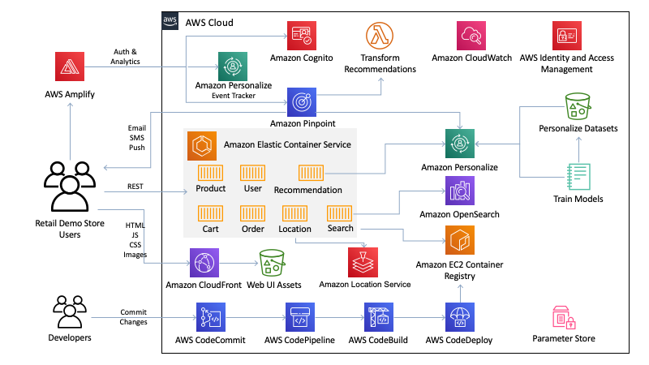

## Introduction

!!! Note 

    This part of the documentation is also inside the demo itself (look for the "demo guide" on the bottom of each page)

The Retail Demo Store
is an open source solution which integrates Amazon Personalize, Amazon Pinpoint and Amazon Lex in a retail web
application demo and workshop platform. The Retail Demo Store is intended to be used as an education tool (not
designed for production usage) for AWS customers to demonstrate how AWS can be used to build compelling customer
experiences for eCommerce, Retail and Digital Marketing use cases.

The Retail Demo Store is a fictitious online store that includes users (shoppers), products, carts and orders as
well as services for search and recommendations and it helps demonstrate how the product recommendations change
based on shopper’s preferences, real-time behavior and history.

Throughout the demo store experience, users are delivered (or have the option to be delivered) engagements across
multiple channels including email and text (SMS). These messages occur at key moments in the shopper lifecycle,
such as signup and abandoned cart. As users interact with the demo store and their emails/texts, real-time
segments based on their behavior are created and then personalized engagements across channels are delivered. By
utilizing Amazon Pinpoint and Amazon Personalize together, shopper interactions across each of these channels
(store, email, SMS) are ingested as a single event stream and fed into the demo store personalization model,
achieving omni-channel ML model retraining. On the other side, the ML personalization model is used to deliver
personalized experiences across each of these channels a harmonized way.

## Architecture 

  The core of the Retail Demo Store is a polyglot microservice architecture deployed as a collection of RESTful
  web services in Amazon Elastic Container Service (ECS). Several AWS managed services are leveraged to provide
  build, deployment, authentication, messaging, search, and personalization capabilities. The web user interface
  is a single page application built using responsive web design frameworks and techniques, producing a native
  app-like experience tailored to the user's device. See the [Workshops](../workshops/hands-on-workshops.md) for details.

## How the Retail Demo Store works

  The Retail Demo Store is designed to display how personalization works and the impact it can have on a shoppers
  experience. The demo has two main components: first, the storefront user interface and second, the demo guide
  which walks the user through all the different components of the web application demo. .

  The storefront user interface is the actual online store. The products presented will change based on the
  shopping preferences of the fictitious “shopper” profile selected. Users will be prompted to select a “shopper”
  after account creation or sign in and will be able to switch “shopper” by selecting the “shopper”details on the
  top-right corner. The demo guide is an educational component that sits on top of the store-front and is designed
  to guide users.

  The demo guide provides more information on how to use the demo during customer meetings. It also includes the
  services and use cases enabled in the demo, as well as some frequently asked Personalize topics.

