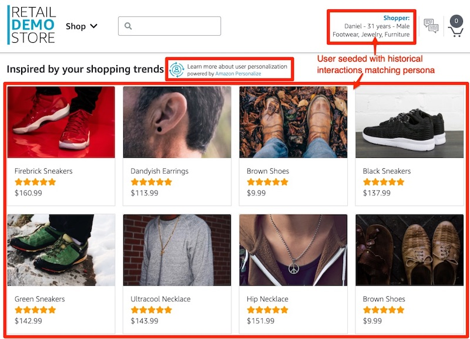
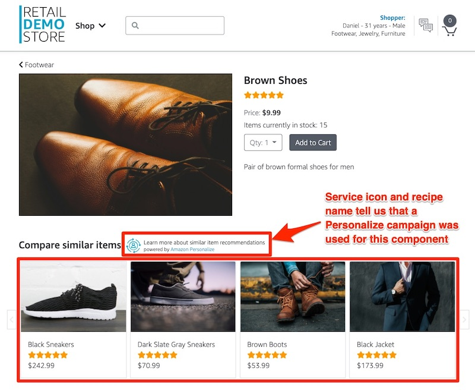
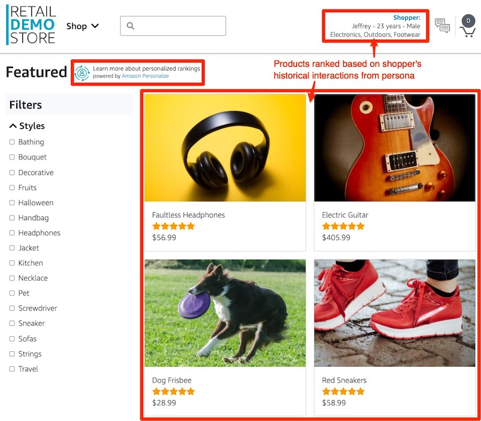
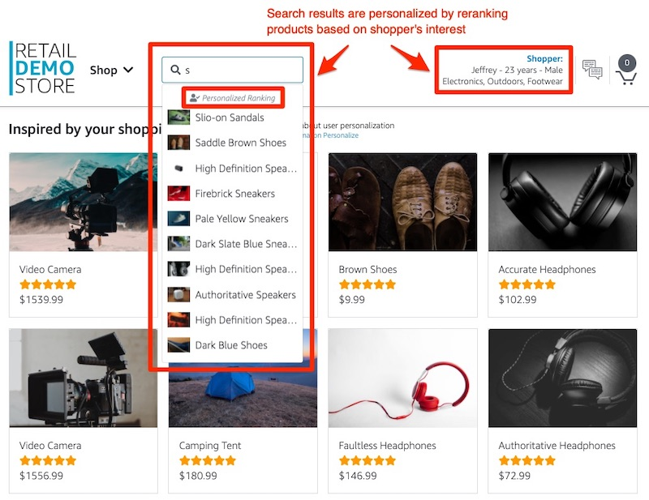

# Personalization

[1 - Creating the Account](1-Creating-account.md) > 2 - Personalization

Personalized user experiences are implemented across several features within the Retail Demo Store web user interface that demonstrate three core use-cases of Amazon Personalize as well as real-time recommendations.

> In order to demonstrate the personalization capabilities of the Retail Demo Store, the required Amazon Personalize Solutions and Campaigns must already be created and enabled via Amazon SSM Parameters. These Solutions and Campaigns can be created as part of the [Personalization workshop](../workshop/1-Personalization/Lab-01-(Core)-Introduction-and-data-preparation.ipynb) bundled with the Retail Demo Store or automatically when the Retail Demo Store is deployed via CloudFormation. If you’re demonstrating with the Retail Demo Store this should already be done for you but still good to be aware if personalization features are not working as expected.

## Datasets

The Retail Demo Store uses all [three supported dataset types](https://docs.aws.amazon.com/personalize/latest/dg/how-it-works-dataset-schema.html) for Amazon Personalize: users, items, and interactions. Additionally, an Amazon Personalize Event Tracker is utilized to capture real-time events in the web user interface which populate the Personalize-managed event interactions dataset. AWS Amplify is used to send events to the Retail Demo Store’s Personalize Event Tracker.

With the exception of the real-time event data which is created as a result of your browsing behavior in the web user interface, the data in the users, items, and interactions datasets are composed of fictitious, or in the case of interactions history, synthetically generated data.

## Shopper Personas

To provide a more compelling and intuitive demo experience, each fictitious user in the Retail Demo Store is assigned a shopper persona. The persona is represented by three categories from the Retail Demo Store’s catalog which the user has an affinity. The affinity for each category is also weighted such that the first category is is highest weighted and the third category is the lowest. There are 16 combinations of categories that represent the personas used across all users.

* furniture_homedecor_housewares
* apparel_footwear_accessories
* instruments_books_electronics
* floral_beauty_jewelry
* groceries_seasonal_tools
* outdoors_instruments_groceries
* housewares_floral_seasonal
* tools_housewares_apparel
* electronics_outdoors_footwear
* seasonal_furniture_floral
* homedecor_electronics_outdoors
* accessories_groceries_books
* footwear_jewelry_furniture
* books_apparel_homedecor
* beauty_accessories_instruments
* housewares_tools_beauty

For example, a user assigned with a persona of "footwear_jewelry_furniture" indicates that the user, at least historically, has been primarily interested in products from the Footwear category and to decreasing degrees of interest in products from the Jewelry and Furniture categories. That initial weighted interest is codified in the generation of the historical interaction dataset which is used to train Solutions in Amazon Personalize. So, for our "footwear_jewelry_furniture" user, interaction events are generated across products in all three of those categories to create a synthetic history of engaging in products matching that persona. Additionally, some products are tagged with an gender affinity. This is used when generating historical events to filter products against the gender of each user to further add realism to the recommendations.

Events for multiple event types are generated to mimic shopping behavior. For example, most generated event types are 'View' to mimic users browsing the site. Occasional checkouts are simulated with 'AddToCart' followed by 'ViewCart', 'StartCheckout', and 'Purchase' events. The Personalize solutions/models are trained on the 'View' event type.

## Emulating Shopper Profiles

With Amazon Personalize Solutions and Campaigns created based on the generated users, items, and interactions datasets, we can emulate (or assume) user profiles for different personas in the web user interface to see recommendations that should be consistent with the persona. In order to emulate a profile, you must first sign in to the user account you created for yourself as described in [Creating a Retail Demo Store account](1-Creating-account.md). Once signed in, you can click on your username in the top right-corner and then select Switch Shoppers.


Figure 7. Access Profile Page.

You can have a shopper auto-selected for you or you can choose your own. In the shopper selection window, specify an age range and a primary shopping interest. Click Submit and a closely matching shopper is shown, confirm your choice or try again. Product recommendations should now match the persona of the shopper you've selected.

> It is recommended to open a new Incognito (Chrome) or Private (Firefox) browser window when testing personalization features of the web UI. The reason for this is because Amplify keeps all of your events tied to the same logical session. Signing out and back in as a different account does not change this behavior. You must close and reopen Private/Incognito windows to switch between profiles.

## Use-Case 1: Personalized Product Recommendations

**Amazon Personalize Recipe:** [User-Personalization](https://docs.aws.amazon.com/personalize/latest/dg/native-recipe-new-item-USER_PERSONALIZATION.html)

The user personalization use-case is implemented on the bottom half of the Retail Demo Store home view **when you are signed in to a Retail Demo Store user** account. Be sure to emulate a shopper profile as described above so that a persona is linked to your session. Product recommendations in the “Inspired by your shopping trends” section are being powered by Amazon Personalize. If you’re not signed in, featured products will be displayed here instead.

> Since the Retail Demo Store is using a Personalize Event Tracker to record real-time interaction events, it is important to keep in mind that recommendations will change as a result of your clicking and browsing activity in the web application. Therefore, the recommendations may not match up to the original shopper persona used to train the model. This is a powerful demo feature, though, since it shows how Personalize adapts to evolving user intent. It can also show how recommendations adapt for new users (i.e. cold starting users).



Figure 8. User recommendation use-case.

## Use-Case 2: Related Products Recommendations

**Amazon Personalize Recipe**: [SIMS](https://docs.aws.amazon.com/personalize/latest/dg/native-recipe-sims.html)

The related products use-case is implemented on the product detail page in the Retail Demo Store. Since inference calls to campaigns built with the SIMS recipe do not require a user, we are able to display related products using SIMS whether you are signed in as a user or anonymous.



Figure 9. Related products use-case.

## Use-Case 3: Personalized Product Ranking

**Amazon Personalize Recipe**: [Personalized-Ranking](https://docs.aws.amazon.com/personalize/latest/dg/native-recipe-search.html)

When you are signed in as a Retail Demo Store user, the personalized ranking use-case is implemented on the category view in the Retail Demo Store. When you are an anonymous user, products are displayed in their natural order (i.e. not ranked). The most effective view to demonstrate this use-case is on the “Featured” product view. The reason for this is that this is the one category view that includes products from multiple categories. Therefore, the ranking should be more impactful.



Figure 10. Personalized Ranking use-case.

You can also see personalized ranking in product search results. That is, if you are signed in as a user, search results are reranked based on the user's historical and real-time activity.



## Event Tracking

The following semantic interaction event types are instrumented in the Retail Demo Store web user interface. Each time a user (anonymous or known) performs one the following actions, an [event is sent](https://github.com/aws-samples/retail-demo-store/blob/master/src/web-ui/src/analytics/AnalyticsHandler.js) to both Amazon Pinpoint (signed in only) and an Amazon Personalize Event Tracker (if configured).

* Search – the user performed a product search
* View – the user viewed details for a product
* AddToCart – the user added a product to their shopping cart
* RemoveFromCart – the user removed a product from their shopping cart
* UpdateQuantity – the user changed the quantity of a product in their shopping cart
* ViewCart– the user viewed their shopping cart
* StartCheckout – the user initiated the checkout process
* Purchase – the user completed an order by completing the checkout process

To assess the impact of real-time event tracking in recommendations made by the user recommendations on the home page, follow these steps.

1. Sign in as (or create) a storefront user.
2. View the product recommendations displayed on the home page under the "Inspired by your shopping trends" header. Take note of the products being recommended.
3. View products from categories that are not being recommended by clicking on their "Details" button. When you view the details for a product, an event is fired and sent to the Personalize event tracker.
4. Return to the home page and you should see products being recommended that are the same or similar to the ones you just viewed.

### Event Instrumentation

If you are demonstrating the Retail Demo Store to a more technical audience, you can illustrate how the events are sent to Pinpoint and Personalize in the background. To do so, open up the Developer Tools in the web browser you’re using (i.e. Chrome), select the Network view, and find the calls to “events” (Personalize) and “legacy” (Pinpoint). The screenshot below illustrates how to display the network call to the Personalize Event Tracker for the “put\_events” endpoint. This is implemented using AWS Amplify to instrument events in the web user interface.


Figure 11. Event instrumentation calls

## Filtering Recommendations

Amazon Personalize supports the ability to create [filters](https://docs.aws.amazon.com/personalize/latest/dg/filter.html) that can be used to filter (or exclude) items from being recommended that match a filter's criteria. The Retail Demo Store uses a filter to exclude products which have been recently purchased by the current user.

As noted in the Event Tracking section above, the Retail Demo Store's web application sends an `Purchase` event for each product purchased by the user. We can use this event type in the following filter expression.

```
EXCLUDE itemId WHERE INTERACTIONS.event_type in ("Purchase")
```

The filter is created using the [CreateFilter](https://docs.aws.amazon.com/personalize/latest/dg/API_CreateFilter.html) API. When a filter is created, a Filter ARN is generated which can then be used when retrieving recommendations to apply the filter.

To demonstrate this capability, purchase one or more recommended products from the "Inspired by your shopping trends" section of the home page by adding them to your cart and checking out. Then return to the home page. The product(s) you just purchased should no longer be recommended.
