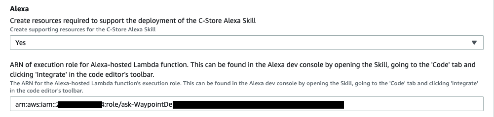

# Alexa Skill Deployment Instructions

The following instructions detail the deployment steps required to deploy an Alexa Skill which integrates with the demo store backend. 

The Skill demonstrates a use case in which the user can pre-order products for collection at a nearby Exxon gas station/C-Store and pay
for them using an Amazon Pay account. 

## Pre-Requisites
These instructions assume that the Retail Demo Store has been deployed 
 using CloudFormation in an AWS account for which you have CLI access configured. 
 You will need to access the CloudFormation stack you created in the AWS Console UI
 to be able to configure Alexa to work with the Retail Demo Store.

## Skill Deployment
- Create an [Amazon developer account](https://www.amazon.com/ap/signin?openid.pape.preferred_auth_policies=Singlefactor&openid.pape.max_auth_age=7200&openid.return_to=https%3A%2F%2Fdeveloper.amazon.com%2Falexa%2Fconsole%2Fask&openid.identity=http%3A%2F%2Fspecs.openid.net%2Fauth%2F2.0%2Fidentifier_select&openid.assoc_handle=amzn_dante_us&openid.mode=checkid_setup&marketPlaceId=ATVPDKIKX0DER&openid.claimed_id=http%3A%2F%2Fspecs.openid.net%2Fauth%2F2.0%2Fidentifier_select&openid.ns=http%3A%2F%2Fspecs.openid.net%2Fauth%2F2.0&)

- Install the ASK (Amazon Skills Kit) CLI tool
    - Ensure Node.JS is installed - see [here](https://nodejs.org/en/download/).
    - In a terminal, run `npm install -g ask-cli`
    - Full instructions available [here](https://developer.amazon.com/en-US/docs/alexa/smapi/quick-start-alexa-skills-kit-command-line-interface.html).

- Configure ASK CLI with the following options
    - In a terminal, enter `ask configure`
    - An authentication web popup should be seen to Give *Alexa Skills Kit Tools* access to Alexa in your Amazon account.
        - Click **Allow**.
    - Back on the terminal, answer **Y** to the question `Do you want to link your AWS account in order to host your Alexa skills? (Y/n)` 
    - Select the profile for the AWS account where the Demo Store CloudFormation is deployed (or create a new profile for that account).
    
- In the `src/alexa/` directory, initialize the Alexa Skill with the following options:
    - In a terminal, enter `ask init` and provide the following answers:
        - `Skill Id (leave empty to create one):` Leave empty 
        - `Skill package path:` . <- Period here, ie. select current directory
        - `Lambda code path for default region (leave empty to not deploy Lambda):` ./lambda
        - `Use AWS CloudFormation to deploy Lambda?  (Y/n)` Y
        - `Lambda runtime:` python3.8
        - ` Lambda handler:` lambda_function.lambda_handler
        - `Does this look correct?  (Y/n)` Y

- Your output from the previous step should appear as follows:
```
? Skill Id (leave empty to create one):
? Skill package path:  .
? Lambda code path for default region (leave empty to not deploy Lambda):  ./lambda
? Use AWS CloudFormation to deploy Lambda?  Yes
? Lambda runtime:  python3.8
? Lambda handler:  lambda_function.lambda_handler
```

- Create the Lambda environment variables by copying the file `./lambda/.envtemplate` to `./lambda/.env` with the following command: `
        
      cp ./lambda/.envtemplate ./lambda/.env
        
- Subsequently, populate the `.env` file you have created as follows:
    - `AWS_REGION`: Deployment region of the Demo Store CloudFormation template. E.g. `us-east-1`
    - `*_SERVICE_URL`: The URLS of the named services. Values found in the 'Outputs' of the 'Services' sub-stack of the Demo Store CloudFormation stack.
    - `PINPOINT_APP_ID`: Value found in the 'Outputs' of the main Demo Store CloudFormation stack.
    - `WAYPOINT_PLACE_INDEX_NAME`: Value found in the 'Outputs' of the 'Waypoint' as the variable 'WaypointResourceName'
    - `ASSUME_ROLE_ARN`: Value found in the 'Outputs' of the 'Alexa' sub-stack of the Demo Store CloudFormation stack. Ensure you get the **ARN** and not just the name of the Role. If this has not been created, ensure that the `CreateAlexaResources` parameter on the Demo Store CloudFormation stack is set to 'Yes'.
    - `COGNITO_DOMAIN`: Leave blank. Populated in the **Cognito Authentication Setup** section. 

- Deploy the Skill with the following step (it may take a few minutes):
    - `ask deploy`
    
  

## Alexa Lambda Execution Permissions
To allow the newly-created Alexa Skill Lambda Function to be able to assume a role belonging to the main Demo Store CloudFormation
Stack, a role in the main stack must be manually updated. For more detail on this process see [the Alexa documentation](https://developer.amazon.com/en-GB/docs/alexa/hosted-skills/alexa-hosted-skills-personal-aws.html). 

- Find the new CloudFormation stack in your AWS account with a name starting `ask-RetailStore`.
    - Take a note of the ARN of the `AlexaSkillIAMRole` within this stack. 
- In the main Demo Store stack, find the 'Alexa' sub-stack & go to the resource called 'AlexaExecutionRole'. 
    - Add the following statement as a 'Trust Relationship', where AlexaSkillIAMRoleArn is the ARN recorded in the previous step
    ```
    {
     "Effect": "Allow",
     "Principal": {
       "AWS": "<AlexaSkillIAMRoleArn>"
     },
     "Action": "sts:AssumeRole"
   }
    

## Cognito Authentication Setup
For the Alexa Skill to fully integrate with the Demo Store backend, the user of the Alexa Skill needs to be able to authenticate
with the Demo Store backend. This requires manual configuration via changes to the Cognito User Pool deployed in the Demo Store 
CloudFormation stack and to the Alexa app. 

These instructions are based on the blog [Amazon Cognito for Alexa Skills User Management
](https://aws.amazon.com/blogs/compute/amazon-cognito-for-alexa-skills-user-management/).

### Cognito Setup
- Go to the Cognito User Pool created by the Demo Store stack and select 'App clients' under 'General Settings'


- Select 'Add another app client' and create a new client called 'alexa'. Leave all other setting as default values.
  - Click **"Create app client"** to create the app client.
  - Take note of the "App client id" for the newly created client - this will be needed to set up authentication in Alexa.
  - Click "Show Details" under the newly created client and take note of the "App client secret" - this will also be needed.
- Under 'App integration' in the Cognito user pool menu, select 'Domain name'


- Create an Amazon Cognito Domain by selecting an available subdomain name and saving your changes.
  In the displayed example the name 'waypoint-alexa-demo' has been selected. 


- Take note of the sub-domain (in the example it is `waypoint-alexa-demo`) 
  and region (in the example it is `eu-west-1`).

- Now go to your [Alexa developer account](https://developer.amazon.com/alexa/console/ask) and open the Skill. 
  In the 'Build' tab select 'Account Linking' under 'Tools'.


- Select the option to allow users to link accounts. Leave the default option for 'Auth Code Grant' selected then fill out the following values:

    - The 'Authorization URI' takes the following form: 
      `https://{Sub-Domain}.auth.{Region}.amazoncognito.com/oauth2/authorize?response_type=code&redirect_uri=https://pitangui.amazon.com/api/skill/link/{Vendor ID}`.
       The sub-domain and region should match those in the Cognito domain defined above. 
       The Vendor ID can be found as the final piece of information in the 'Alexa Redirect URLs' at the bottom of the
       present Alexa Account Linking page (in the below image this is `M35YJ406061H7V`).

    - The 'Access Token URI' takes the following form: `https://{Sub-Domain}.auth.{region}.amazoncognito.com/oauth2/token`, 
      with the variables populated as in the URI above. 
    - The 'App Client ID' and 'App Client Secret' values can be found in Cognito in the 'App Clients' section (see above).

    - Enter the above values, leave the remaining values on the page as default, and hit the 'Save' button.
    
- Return to the Cognito User Pool UI and go to the 'App Client Settings' section under 'App Integration' 
  and go to the section for the 'alexa' client created previously. Click "Show Details".
    - Under 'Enabled Identity Providers' select 'Cognito User Pool'
    - Set 'Callback URLs' to the three 'Alexa Redirect URLs' from the Alexa Account Linking page, separated by commas
        - eg. `https://layla.amazon.com/api/skill/link/{Vendor ID},https://alexa.amazon.co.jp/api/skill/link/{Vendor ID},https://pitangui.amazon.com/api/skill/link/{Vendor ID}`
    - Set 'Sign out URLs' to: `https://{SubDomain}.auth.{Region}.amazoncognito.com/logout?response_type=code`, 
      with the placeholders populated as above.
    - Under 'Allowed OAuth Flows', select 'Authorization code grant'
    - Under 'Allowed OAuth Scopes', select 'phone', 'email', 'openid' and 'profile'.
    - Save these changes. It should now be possible to click the 'Launch Hosted UI' button below this form, 
      at which point you should see a functioning sign-in page where users that have been created with the Retail
      Demo Store UI can be logged in and get a "Linking successful" message. If not, go back and check the previous steps. 


- Finally, update the Alexa Skill's `.env` file (at `./lambda/.env`) as follows:
    - `COGNITO_DOMAIN`: `https://{SubDomain}.auth.{Region}.amazoncognito.com`
        - Ensure the exact format is followed (include `https://` protocol, no trailing slash)
    - Redeploy the Skill by running `ask deploy`

- You Alexa Skill should now be ready for full usage with account linking to the Demo Store back-end.  

## Testing & Usage
Before testing or using the Alexa Skill, please ensure you have followed & completed the steps in the **Pre-Requisites**, **Skill Deployment** and **Cognito Authentication Setup** sections.

To test the Skill, install the Alexa application on a mobile device and log in using your Amazon Developer credentials (alternatively, test through the [Web UI](https://developer.amazon.com/alexa/console/ask/test).
 The Skill can be found by going to 'More' > 'Skills & Games' > 'Your Skills' > 'Dev'. Select the created Skill & authenticate with the Demo Store back-end (under 'Settings') to enable full functionality. 

Start the demo by this phrase:

           "Alexa, ask C-Store Demo to take me to the nearest Exxon"

Or:

            “Alexa, open C-Store Demo” followed by: 
            “Take me to the nearest Exxon” 

Once the account has been linked on your Alexa device, you can also test on the Alexa Developer Console, as the linked account credentials are shared across the account.   

NOTE: The Skill can only be tested on an Alexa-enabled device (including the mobile app) unless the device local _exactly_ matches that of the Skill (English US). This can be set in 'Device Settings' on your Alexa device.   

## Deletion & Cleanup
Before deleting the Demo Store CloudFormation stack, the Cognito domain & App Client created in the **Cognito Authentication Setup** section must be manually deleted.

To remove the remaining resources created by this demo, find and delete the Alexa CloudFormation stack in your AWS account.   