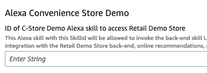

# Location-aware Hands-free Ordering Alexa Skill

## Skill summary

The Retail Demo Store comes with an [Amazon Alexa](https://developer.amazon.com/en-US/alexa) skill that enables voice 
search for nearby stores powered by [Amazon Location Service](https://aws.amazon.com/location/) and hands-free ordering, along with optional recommendations by
 [Amazon Personalize](https://aws.amazon.com/personalize/), and a flow simulating pick-up at the nearby 
 convenience store (c-store). Users are authenticated with Retail Demo Store using
 [Amazon Cognito](https://aws.amazon.com/cognito/).
 
Frictionless shopping based on location makes sense because shoppers are already near the pick-up site. 
Returns or cancellations are likely to be much rarer, and even though their order is typically
ready when they arrive, shoppers also have the opportunity to participate in the in-store experience. 
 
The user experience we will enable through this workshop is as follows:

1. The Alexa user opens the Store Demo in Alexa with the skill invocation name "Retail Demo Store".
2. The Alexa user may now search for a nearby convenience store using Amazon Location Service
   (user location is mocked for this demo). Note that this step could be merged into step 1.
3. The Alexa user is then given the opportunity to order products from  a list of products pulled from the Retail Demo Store products catalogue.
4. A recommended extra purchase is proposed using the Retail Demo Store built-in recommendations system. 
   Amazon Personalize has learnt from the data what products tend to go well together.
5. Depending on whether Cognito/Alexa account linking has been set up AND the user has logged in via account linking:
    1. If account linking is set up, the user's email address will be retrieved.
    2. Otherwise, a default email address will be retrieved from the default CloudFormation parameters of the Retail Demo Store. 
6. The user's order will be registered as an order in Retail Demo Store
7. If an Amazon PinPoint email channel has been setup, an order confirmation will be sent.

For more details about how this skill works, check:
 - The relevant Amazon Developer Alexa [docs](https://developer.amazon.com/en-US/docs/alexa/ask-overviews/what-is-the-alexa-skills-kit.html). In particular:
    - The concepts of [hosting a custom skill with an AWS Lambda function endpoint](https://developer.amazon.com/en-US/docs/alexa/custom-skills/host-a-custom-skill-as-an-aws-lambda-function.html).
    - What is meant by [intents, slots, and dialogs](https://developer.amazon.com/en-US/docs/alexa/custom-skills/create-and-edit-custom-slot-types.html).
 - The interaction model in this repository [src/alexa/skill-package/custom/en-US.json](../../src/alexa/skill-package/custom/en-US.json) shows the slots and intents the skill is configured to handle.
 - The AWS Lambda handling function in this repository [src/aws-lambda/alexa-skill-lambda/alexa-skill-lambda.py](../../src/aws-lambda/alexa-skill-lambda/alexa-skill-lambda.py) is the code used for handling the back-end for the skill.

Note that there are several levels to this experience depending on how much setup is done:

1. You may set up the Alexa skill and connect it to Retail Demo Store to get location search, product search and recommendations.
   **Note**: the recommendations will only work well if the Personalize resources are deployed 
   using the built-in Lambda by selecting the "Auto-Build Personalize Campaigns" parameter in the Retail Demo Store
   CloudFormation: there is no workshop for training Amazon Personalize on realistic c-store customer interactions.
2. You may set up Cognito/Alexa account linking to enable user details to be retrieved by the the Alexa skill.
3. Configure Amazon Pinpoint to enable order confirmation emails. 

How to enable each of these capabilities is discussed in the next sections.

## Deployment Instructions

The following instructions detail the deployment steps required to deploy the Alexa Skill which integrates with 
the Retail Demo Store back-end. 

## Skill Deployment

### High-level concepts

1. You will first create an Alexa Skill in your Amazon Developer account. This skill will initially not have an endpoint set up for handling its back-end logic.
2. You will update the Retail Demo Store CloudFormation template with the Skill ID, which will deploy the Alexa skill backend AWS Lambda function with permissions configured to allow the Alexa Skill to call it.
3. You will retrieve the Arn of the newly deployed Lambda function and configure your Alexa Skill to use it.

### Pre-Requisites

These instructions assume that the Retail Demo Store has been deployed using CloudFormation in an AWS account for which you have CLI access configured.  
You will need to access the CloudFormation stack you created in the AWS Console UI to be able to configure Alexa to work with the Retail Demo Store.

### Step-by-step

The following instructions can be run from within a SageMaker, Cloud9 or local terminal session.

When you deployed Retail Demo Store, a SageMaker notebook was created for you in the same region that you deployed Retail Demo Store. We recommend you make use of this.  
To start working in the SageMaker notebook, navigate to: "[SageMaker Notebook Instances](https://console.aws.amazon.com/sagemaker/home#/notebook-instances)"  
Choose your Notebook instance (this will have been deployed for you if you have already deployed Retail Demo Store into your account).  
Now, click "Open Jupyter" > "New" > "Terminal" and follow the instructions below.

1. Obtain the Retail Demo Store repository.
 
   - If you are using the SageMaker notebook server deployed by the Retail Demo Store, the repository will already be available.  
     As your first command type the following so that any files you work with are visible to the Jupyter editor:
      ```bash
      cd SageMaker 
      ```  
   - Otherwise, to get the repository available locally, or in your SageMaker or Cloud9 instance, run:
      ```bash
      git clone git@github.com:aws-samples/retail-demo-store.git
      ```
     If you are using a different repository the URL may be different and, if it is a private repository, you may need to enter your credentials. 
  
2. Change into the Alexa folder in the repository:
    ```bash
    cd retail-demo-store/src/alexa
    ```
  
3. Install the ASK (Amazon Skills Kit) CLI tool
    - Ensure Node.JS is installed - see [here](https://nodejs.org/en/download/). This is already done for you in SageMaker and Cloud9.
    - In a terminal, run the following to install the Amazon Alexa CLI tool.:
      ```bash
      npm install -g ask-cli
      ``` 
      Full instructions on the ASK CLI is available [here](https://developer.amazon.com/en-US/docs/alexa/smapi/quick-start-alexa-skills-kit-command-line-interface.html).

4. Create a new (or use your existing) [Amazon developer account](https://developer.amazon.com/dashboard) to which you are going to deploy your skill.
   - When done, switch back to cloud9 to follow this workshop.

5. Configure ASK CLI with the following options:
    - In a terminal, enter: 
      ```
      ask configure --no-browser
      ```
    - A URL will be presented that you can enter into a browser so that you can log in to your Amazon Developer account and obtain an authorisation token that you can enter into the CLI.
6. Paste the token on the shell
    - Answer **n** (*no*) to the question:  
      `Do you want to link your AWS account in order to host your Alexa skills? (Y/n)`  
      as we will link the to the account containing Retail Demo Store ourselves below.
   - The session should look like this:
      ```
      $ ask configure --no-browser

      This command will configure the ASK CLI with a profile associated with your Amazon developer credentials.
      ------------------------- Step 1 of 2 : ASK CLI Configuration -------------------------
      ? Please create a new profile or overwrite the existing profile.
      Create new profile
      ? Please provide a profile name or press enter to use default as the profile name:  default
      [Warn]: ASK CLI uses authorization code to fetch LWA tokens. Do not share neither your authorization code nor access tokens.
      Paste the following url to your browser:
         https://www.amazon.com/ap/oa?response_type=code&client_id=amzn1.application-oa2-client.aaxxxxxxxxxxxxxxxxx56&state=Ask-SkillModel-ReadWrite&scope=alexa%3A%3Aask%3Askills%3Areadwrite%20alexa%3A%3Aask%3Amodels%3Areadwrite%20alexa%3A%3Aask%3Askills%3Atest%20alexa%3A%3Aask%3Acatalogs%3Aread%20alexa%3A%3Aask%3Acatalogs%3Areadwrite%20alexa%3A%3Aask%3Asubscriptions%20alexa%3A%3Aask%3Askills%3Adebug&redirect_uri=https%3A%2F%2Fask-cli-static-content.s3-us-west-2.amazonaws.com%2Fhtml%2Fask-cli-no-browser.html
      ? Please enter the Authorization Code:  XXXXXXXXXXXXXXXXXXX
      ASK Profile "default" was successfully created. The details are recorded in ask-cli config file (.ask/cli_config) located at your **HOME** folder.
      Vendor ID set as XXXXXXXXXXXXxx.

      ------------------------- Step 2 of 2 : Associate an AWS Profile with ASK CLI -------------------------
      [Warn]: ASK CLI will create an IAM user and generate corresponding access key id and secret access key. Do not share neither of them.
      ? Do you want to link your AWS account in order to host your Alexa skills? No
      ------------------------- Skipping the AWS profile association -------------------------
      You will only be able to deploy your Alexa skill. To set up AWS credentials later, use the "ask configure" command towards the same profile again.
      ------------------------- Configuration Complete -------------------------
      Here is the summary for the profile setup: 
      ASK Profile: default
      AWS Profile: undefined
      Vendor ID: XXXXXXXXXXXXXXxx
      ```
   - **Take a note of the Vendor ID, you will need it later in the workshop**
     
7. Run the following to copy the skill definition into the deployment package (you will later overwrite the endpoint configuration to point at the endpoint Lambda deployed in the retail demo store). :
   ```
   cp template.skill.json skill-package/skill.json
   ```
   
8. Still in the `src/alexa/` directory, initialize the Alexa Skill with the following command:
   ```
   ask init
   ```
   Provide the following answers:  
      `Skill Id (leave empty to create one):` <- Leave empty  
      `Skill package path:  (./skill-package)` . <- Leave default: skill-package  
      `Lambda code path for default region (leave empty to not deploy Lambda):` <- Make this blank by pressing backspace  
      `Does this look correct?  (Y/n)` Y

   Your output from the previous step should appear as follows:
    ```
    ? Skill Id (leave empty to create one):
    ? Skill package path: ./skill-package
    ? Lambda code path for default region (leave empty to not deploy Lambda):
    ```

9. Now you can deploy the skill (but it won't work for testing yet because you have not yet set up the back-end - you are deploying the interaction model only):
    ```
    ask deploy --target skill-metadata
    ```
   The Skill ID will be printed on the console. You can also retrieve it from your 
   [Alexa developer console](https://developer.amazon.com/alexa/console/ask) as shown below:

   

10. We are going to enter this skill ID into your Retail Demo Store CloudFormation template, so that it can deploy the AWS Lambda function that serves as the skill back-end.
      - Go to your AWS CloudFormation Console and open the Retail Demo Store stack.
      - Make sure that ``View Nested`` is not selected
      - Select the root stack, usually named "retaildemostore", and not any of the nested stacks. 
      - Click "Update" > "Use current template". Then click "Next"
      - Enter the following parameters: 
      - Under "*ID of C-Store Demo Alexa skill to access Retail Demo Store*", enter the Skill ID you retrieved in the previous step.     
      - You can also enter an email address under "*An email to test Alexa integration in case you have not set up Cognito authorisation to link your Retail Demo Store account*".
      This is so that you can receive order confirmation emails without setting up Cognito (An Amazon Pinpoint e-mail channel also needs to be configured).  
        
      - Click "Next" > "Next", ensuring to check the checkboxes "I acknowledge that...", then click "Update stack". 
      - CloudFormation will now update the stack and deploy the endpoint for handling
      the back-end functions for this skill, as well as permissions allowing the skill to invoke the
      endpoint. 
      - Wait for the stack to enter `UPDATE_COMPLETE` state. You may have to click the update
      view icon to see the latest state of the stack.

11. Now we need to connect the Alexa Skill to the Lambda endpoint. 

      - Ensure the CloudFormation operation is complete.
      - In the AWS CloudFormation Console, select the Retail Demo Store root stack, then click on the "Outputs" tab.
      - Search for the key: `AlexaSkillEndpointArn` and copy the value. 
         - If it is set to "NotDeployed", something has gone wrong - check the previous steps. Otherwise, its value should be of the form:  
      `arn:aws:lambda:REGION:ACCOUNT:function:STACK-Alexa-XYZ-AlexaSkillFunction-ABC`
    
12. Go back to your repository (e.g. in your Sagemaker notebook instance).  
   - Inside the `src/alexa` folder there is a subfolder called `skill-package`
    into which you created a `skill.json` file in a previous step. 
   - Update the "`apis`" key in that `skill.json`
    file so that the endpoint is set to the Lambda Arn you obtained above. The "`apis`" section in the 
    JSON should end up having the form: 
      ```
      "apis": {
         "custom": {
            "endpoint": {
               "uri": "arn:aws:lambda:REGION:ACCOUNT:function:STACK-Alexa-XYZ-AlexaSkillFunction-ABC"
            }
         }
      },
      ```
13. Now re-deploy the skill, so that the endpoint is configured on the skill:
    ```
    ask deploy --target skill-metadata
    ```    
14. You should see "*Skill package deployed successfully.*"  Your skill should be ready to test!

### Testing the Skill.

You should be able to test your skill on the "Test" tab of the Skill page in your 
[Amazon Alexa developer console](https://developer.amazon.com/alexa/console/ask).
- Switch "Skill testing is enabled in" from "Off" to "Development".

Try saying:

1. "Retail Demo Store". Alexa should prompt you to ask for your nearest convenience store.
2. Then: "Nearest store". Alexa should report its address and distance, and prompt you to order.
3. Answer "Yes", then when asked what you would like to buy, say: "Pizza". Alexa should add it to your shopping cart and prompt an extra product.
4. You can continue adding products to your basket.

You can say "checkout" at any time to submit your order. 

### Debugging the Skill.

You can find logs for the skill back-end.

- Go to the Lambda Dashboard and select 'Functions'.  Search for the Alexa skill function by typing "Alexa" into the filter.
- Select the Lambda function which has the naming convention:
```
{stack name}-Alexa-{[A-Za-z0-9]+}-AlexaSkillFunction-{[A-Za-z0-9]+}
```
e.g. ```retaildemostore-Alexa-C7A4AAA5A-AlexaSkillFunction-FyAAAAAAF2mm```
This will take you to to the Lambda function configuration.
- From there, click "Monitor" > "View Logs in CloudWatch".
