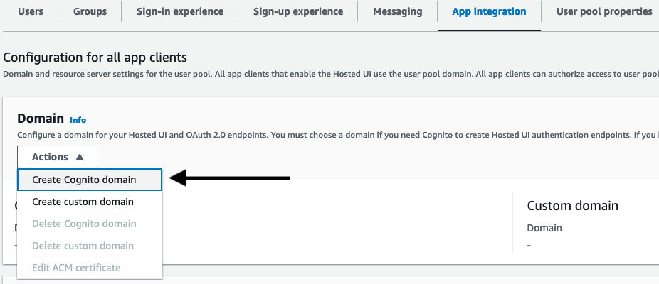
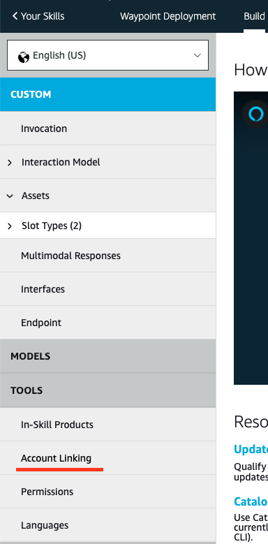
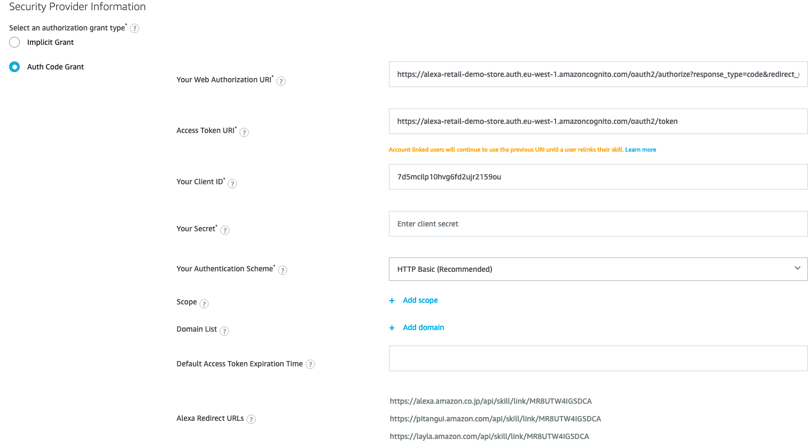
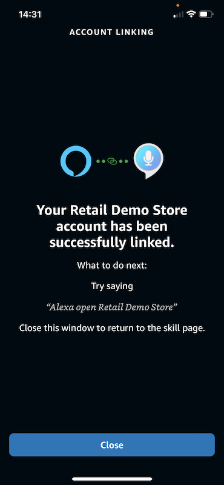

## Cognito Authentication Setup

### High-level concepts

For the Alexa Skill to fully integrate with the Demo Store backend and obtain email and other
details of a particular Retail Demo Store user, the user of the Alexa Skill needs to be able to authenticate
with the Retail Demo Store backend. This guide will show you how to manualy configure the Cognito User Pool deployed in the Demo Store CloudFormation stack and to the Alexa app.

The user flow is:

1. User links their account within the Alexa app.
2. Alexa redirects to the custom login hosted by Cognito.
3. The user logs in and is redirected back to Alexa with an authorization code.
4. Alexa uses the authorization code to obtain an access token from Cognito.
5. This token is sent to the back-end and can be used for accessing user details
  from Cognito. The token has permissions boundaries determined when setting up
  the Cognito interface. 
6. Now the back-end can use the user's email for sending them emails and
   adding orders.  
     
These instructions are based on the blog 
[Amazon Cognito for Alexa Skills User Management](https://aws.amazon.com/blogs/compute/amazon-cognito-for-alexa-skills-user-management/).

### Pre-Requisites

These instructions assume that the Alexa skill has been deployed as per previous section - [Alexa Skill Deployment Instructions](5.2-AlexaHandsfree-Lab-1-Skill-deploy.md)

### Step-by-step Cognito setup

We suggest you use a text editor to keep track of the configuration as you generate it. You are instructed as to which details to keep.

1. Go to the Amazon Cognito console, select User pools and then select the Cognito User Pool created by the Retail Demo Store stack.  It should have a naming convention: 
   `{stack name}-{region}-user-pool`
e.g ***retaildemostore-eu-west-1-user-pool***. 
   
2. 
   Select the 'App integration' tab
   
   Then scroll down to 'App clients and analytics' and select ***Create app client***
   

3. Select 'Confidential client' and enter ***alexa*** as the App client name.
   
   - Click **"Create app client"** to create the app client.
   - Once created, select the newly created app client
   - Take note of both the ***Client ID*** and ***Client secret*** as
     these will be needed to set up authentication in Alexa.
      -  To reveal the Client secret, click on the 'Show client secret' toggle.
  
4. Next, go back to the retail demo store user pool and select 'App integration' tab. Within the  Domain section, click on the Actions menu and select ***Create Cognito domain***.

   

5. Create an Amazon Cognito Domain by choosing an available subdomain name and saving your changes.
   In the displayed example the name ```alexa-retail-demo-store``` has been chosen.
    
   

6. Take note of the Cognito domain (in the example it is `https://alexa-retail-demo-store.auth.eu-west-1.amazoncognito.com`).

7. Now go to your [Alexa developer account](https://developer.amazon.com/alexa/console/ask) and open the Skill. 
   In the 'Build' tab select 'Account Linking' under 'Tools'.
   
   

8. Select the option to allow users to link accounts:

   
   
   Leave the default option for 'Auth Code Grant' selected then fill out the following values:
   
   - The 'Web Authorization URI' takes the following form: 
     `{Cognito Domain}/oauth2/authorize?response_type=code&redirect_uri=https://pitangui.amazon.com/api/skill/link/{Vendor ID}`.
      - The Cognito domain should match the one defined above. 
      - The Vendor ID can be found as the final piece of information in the 'Alexa Redirect URLs' at the bottom of the
      present Alexa Account Linking page (in the below image this is `MR8UTW4IGSDCA`).  
      - After substituting the values it should look something like: `https://alexa-retail-demo-store.auth.eu-west-1.amazoncognito.com/oauth2/authorize?response_type=code&redirect_uri=https://pitangui.amazon.com/api/skill/link/MR8UTW4IGSDCA`

   - Take note of all the Alexa Redirect Url's, as these will be needed for the Allowed callback URLs in the Cognito Hosted UI setup
      
       
   - The 'Access Token URI' takes the following form: `{Cognito Domain}/oauth2/token`, 
     with the Cognito Domain populated as in the URI above. 
   - Enter 'Your Client ID' and 'Your Secret' values using the values you noted above from creating the Cognito app client.
   
     
   - Leave the remaining values on the page as default, and hit the 'Save' button (this may be at the top of the page).
    
9. Return to the AWS Console and the Cognito User Pool UI, and select the 'retail demo store' user pool.  Go to the 'App clients and analytics' section under the 'App Integration' tab and select the 'alexa' client created previously (<span style="color:red">note: there will be 
   another app client in the list that handles the Retail Demo Store UI authentication - be careful not to work with that one by mistake</span>).
   - Scroll down to the ***Hosted UI*** section and click ***Edit***.
    
    - Under 'Hosted sign-up and sign-in pages' go to the Allowed callback URLs section.
    - Add 'Callback URLs' for the three 'Alexa Redirect URLs' from the Alexa Account Linking page:
      
    - Add a 'Sign out URL' with the following format: ``` {Cognito Domain}/logout?response_type=code ``` 
      For example: `https://alexa-retail-demo-store.auth.eu-west-1.amazoncognito.com/logout?response_type=code`
    - Under 'Allowed OAuth Flows', select 'Authorization code grant'
    - Under 'Allowed OAuth Scopes', select 'phone', 'email', 'openid' and 'profile'.
    
    - Save these changes. It should now be possible to click the 'Launch Hosted UI' button below this form, 
      at which point you should see a functioning sign-in page where users that have been created with the Retail
      Demo Store UI can be logged in and get a "Linking successful" message. 
      If not, go back and check the previous steps.

10. Finally, go to the Lambda dashboard and select the `AlexaSkillFunction` (You can search for the function by typing 'alexa' into the search filter).
    Select the Configuration tab, choose Environment Variables, and click Edit.
    Click on the 'Add environment variable' and enter:
    - Key: COGNITO_DOMAIN
    - Value: {Cognito Domain}

   
    This configures the Lambda skill back-end endpoint with the Cognito domain.  Ensure there is no trailing slash when entering the Cognito Domain

11. Your Alexa Skill should now be ready for full usage with account linking to the Demo Store back-end. 
    Testing is best done using the Alexa mobile app.
    Browse to [https://alexa.amazon.com](https://alexa.amazon.com), on your mobile to install or open the Alexa app.  
    **Note**: <span style="color:red">The Skill can only be tested on an Alexa-enabled device (including the mobile app) 
          if the device locale _exactly_ matches that of the Skill (English US).  This can be set in "Device Settings" on your Alexa device.</span>         
    - Go to: "More" > "Skills & Games" > "Your Skills" > "Dev" 
    - Select the "Retail Demo Store" skill
    - Select "Account Linking" > "Link Account"
    and enter the login details of a user you have previously created using the Retail Demo Store UI. 
    - This is what a successful linking should look like:

    

12. When you launch the Retail Demo Store skill through your Alexa device and attempt to checkout, you will hear the message:
    "Hope to see you again soon {profile name}" rather than "Thanks for playing!". 
    Orders will be entered against the user and emails sent to the user by Retail Demo Store.
   