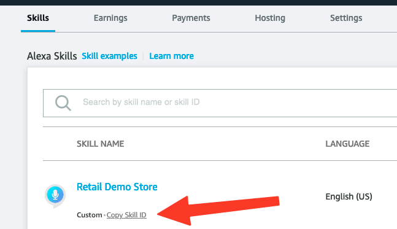
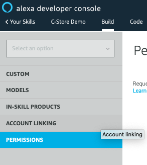

# Location-aware Hands-free Ordering Alexa Skill

## Skill summary

The Retail Demo Store comes with an [Amazon Alexa](https://developer.amazon.com/en-US/alexa) skill that enables voice 
search for nearby stores powered by [Amazon Location Service](https://aws.amazon.com/location/), hands-free ordering
and checkout with [Amazon Pay](https://pay.amazon.com/), along with optional recommendations by
 [Amazon Personalize](https://aws.amazon.com/personalize/), and a flow simulating pick-up at the nearby 
 convenience store (c-store). Users are authenticated with Retail Demo Store using
 [Amazon Cognito](https://aws.amazon.com/cognito/).
 
Frictionless shopping based on location makes sense, because shoppers are already near the pick-up site. 
Returns or cancellations are likely to be much rarer, and even though their order is typically
ready when they arrive, shoppers also have the opportunity to participate in the in-store experience. 
 
The user experience looks like this:

1. The Alexa user opens the Location Service Convenience Store Demo in Alexa with the skill invocation name "Location Service Convenience Store Demo".
2. The Alexa user may now search for a nearby convenience store using Amazon Location
   (user location is mocked for this demo). Note that this step could be merged into step 1.
3. The Alexa user is given the opportunity to order products from there, 
   from a list of products pulled from the Retail Demo Store products catalogue.
4. A recommended extra purchase is proposed using the Retail Demo Store built-in recommendations system. 
   Amazon Personalize has learnt what products tend to go well together, from the data.  
5. Depending on whether Cognito/Alexa account linking has been set up AND the user has logged in via account linking:
    1. If account linking is set up, the user's email address will be retrieved.
    2. Otherwise, a default email address will be retrieved from the default CloudFormation parameters to
       Retail Demo Store.
6. Depending on whether the Alexa skill has been integrated with an Amazon Pay sandbox account ,
   and the user email used is a valid test email:
    1. If Amazon Pay is integrated, the user will have the opportunity to check out with Amazon Pay.
    2. Otherwise, the session will be ended prematurely.
7. If the payment is approved, the user's order will be registered as an order in Retail Demo Store.    

Note that because this is a skill that is designed around the fact that the order will be placed at a nearby 
convenience store, we can afford to provide friction-free shopping in the knowledge that the customer is already
on their way to pick the order up.

For more details about how this skill works, check:
 - The relevant Amazon Developer Alexa [docs](https://developer.amazon.com/en-US/docs/alexa/ask-overviews/what-is-the-alexa-skills-kit.html). In particular:
    - The concepts of [hosting a custom skill with an AWS Lambda function endpoint](https://developer.amazon.com/en-US/docs/alexa/custom-skills/host-a-custom-skill-as-an-aws-lambda-function.html).
    - What is meant by [intents, slots, and dialogs](https://developer.amazon.com/en-US/docs/alexa/custom-skills/create-and-edit-custom-slot-types.html).
 - The interaction model in this repository [src/alexa/skill-package/custom/en-US.json](../../src/alexa/skill-package/custom/en-US.json) which shows the slots and intents the skill is configured to handle.
 - The AWS Lambda handling function in this repository [src/aws-lambda/alexa-skill-lambda/alexa-skill-lambda.py](../../src/aws-lambda/alexa-skill-lambda/alexa-skill-lambda.py) which is the code used for handling the back-end for the skill.

Note that there are several levels to this experience depending on how much setup is done:

1. You may set up the Alexa skill and connect it to Retail Demo Store to get location search, 
   product search and recommendations.
   **Note**: the recommendations will only work well if the Personalize resources are deployed 
   using the built-in Lambda by selecting the "Auto-Build Personalize Campaigns" parameter in the Retail Demo Store
   CloudFormation: there is no workshop for training Amazon Personalize on realistic C-store customer interactions.
2. You may set up Cognito/Alexa account linking to enable user details to come into the Alexa skill.
3. You may set up Amazon Pay/Alexa integration to enable users to checkout with Amazon Pay.

How to enable each of these capabilities is discussed in the next sections.

## Deployment Instructions

The following instructions detail the deployment steps required to deploy the Alexa Skill which integrates with 
the Retail Demo Store back-end. 

### Skill Deployment

#### High-level concepts

1. You will first create an Alexa Skill in your Amazon Developer account. This skill will not have an endpoint set up 
   for handling its back-end logic.
2. You will enter the Skill ID into your Retail Demo Store CloudFormation and an AWS Lambda function will be deployed
   for you with permissions configured to allow the Alexa Skill to call it.
3. You will retrieve the Arn of that Lambda function from CloudFormation and configure your Alexa Skill to 
   make use of that Lambda function.

#### Pre-Requisites

These instructions assume that the Retail Demo Store has been deployed 
 using CloudFormation in an AWS account for which you have CLI access configured. 
 You will need to access the CloudFormation stack you created in the AWS Console UI
 to be able to configure Alexa to work with the Retail Demo Store.

#### Step-by-step

The following instructions can be run from within a SageMaker, Cloud9 or local terminal session.

When you deployed Retail Demo Store, a SageMaker notebook was created for you 
in the same region that you deployed Retail Demo Store. We recommend you make use of this. 
To start working in the SageMaker notebook, navigate to 
"[SageMaker Notebook Instances](https://console.aws.amazon.com/sagemaker/home#/notebook-instances)"
Choose your Notebook instance (this will have been deployed for you if you have already deployed
Retail Demo Store into your account). Now, click "Open Jupyter" > "New" > "Terminal". 

1. Obtain the Retail Demo Store repository.
 
   - If you are using the SageMaker notebook server deployed by the Retail Demo Store, the repository will already be 
     available. As your first command type `cd SageMaker` so that any files you work with are 
     visible to the Jupyter editor.
   - Otherwise, to get the repository available locally, or in your SageMaker or Cloud9 instance, run:
  `git clone git@github.com:aws-samples/retail-demo-store.git`
  If you are using a different repository the URL may be different and if it is a private repository you may need
  to enter your credentials. 
  
2. Change into the respoitory folder:

    `cd retail-demo-store`
  
3. Change into the Alex folder in the repository:

    `cd src/alexa`
  
4. Install the ASK (Amazon Skills Kit) CLI tool
    - Ensure Node.JS is installed - see [here](https://nodejs.org/en/download/). This is already done for you in
      SageMaker and Cloud9.
    - In a terminal, run `npm install -g ask-cli` to install the Amazon Alexa CLI tool.
      Full instructions available [here](https://developer.amazon.com/en-US/docs/alexa/smapi/quick-start-alexa-skills-kit-command-line-interface.html).

5. Create an [Amazon developer account](https://www.amazon.com/ap/signin?openid.pape.preferred_auth_policies=Singlefactor&openid.pape.max_auth_age=7200&openid.return_to=https%3A%2F%2Fdeveloper.amazon.com%2Falexa%2Fconsole%2Fask&openid.identity=http%3A%2F%2Fspecs.openid.net%2Fauth%2F2.0%2Fidentifier_select&openid.assoc_handle=amzn_dante_us&openid.mode=checkid_setup&marketPlaceId=ATVPDKIKX0DER&openid.claimed_id=http%3A%2F%2Fspecs.openid.net%2Fauth%2F2.0%2Fidentifier_select&openid.ns=http%3A%2F%2Fspecs.openid.net%2Fauth%2F2.0&)
   to which you are going to deploy your skill.

6. Configure ASK CLI with the following options
    - In a terminal, enter `ask configure --no-browser`
    - A URL will be presented that you can enter into a browser so that you can log in to your Amazon Developer account
      and obtain an authorisation token that you can enter into the CLI.    
    - Answer **n** (*no*) to the question 
      `Do you want to link your AWS account in order to host your Alexa skills? (Y/n)` 
      as we will link the to the account containing Retail Demo Store ourselves below.
     
7. Run `cp template.skill.json skill-package/skill.json` to copy the skill definition into the deployment package 
  (you will later overwrite the endpoint configuration in there to point at the endpoint Lambda deployed in the 
  retail demo store). 
   
8. Still in the `src/alexa/` directory, initialize the Alexa Skill with the following options:
    - In a terminal, enter `ask init` and provide the following answers:
        - `Skill Id (leave empty to create one):` <- Leave empty
        - `Skill package path:  (./skill-package)` . <- Leave default: skill-package
        - `Lambda code path for default region (leave empty to not deploy Lambda):` <- Make this blank by pressing backspace
        - `Does this look correct?  (Y/n)` Y

9. Your output from the previous step should appear as follows:
    ```
    ? Skill Id (leave empty to create one):
    ? Skill package path: ./skill-package
    ? Lambda code path for default region (leave empty to not deploy Lambda):
    ```

10. Now you can deploy the skill (but it won't work for testing yet because you have not yet set up the back-end -
    you are deploying the interaction model only):
    ```
    ask deploy --target skill-metadata
    ```
   The Skill ID will be printed on the console. You can also retrieve it from your 
   [Alexa developer console](https://developer.amazon.com/alexa/console/ask) as shown below:
   

11. Now we are going to enter this skill ID into your Retail Demo Store CloudFormation deployment
    so that it can deploy the AWS Lambda function that serves as the skill back-end.
    Go to your AWS CloudFormation Console, open the Retail Demo Store stack that you deployed and that will 
    host your Alexa skill back-end. Click "Update" > "Use Current Template". Enter the
    following parameters: 
    - Under "*ID of C-Store Demo Alexa skill to access Retail Demo Store*", enter the Skill ID you retrieved in the 
      previous step. 
    - You can also enter an email address under 
      "An email to test Alexa integration in case you have not set up Cognito authorisation to link your 
      Retail Demo Store account"
      so that you will receive emails while testing until you can set up Cognito integration.
    Choose "Next" > "Next", ensuring to check the checkboxes "I acknowledge that...",
    and choose "Update stack". CloudFormation will now update the stack and deploy the endpoint for handling
    the back-end functions for this skill, as well as permissions allowing the skill to invoke the
    endpoint. Wait for the stack to enter `UPDATE_COMPLETE` state. You may have to click the update
    view icon to see the latest state of the stack.

12. Now we need to connect the Skill up to the endpoint. Once the previous CloudFormation operation is complete,
    again in your AWS CloudFormation Console, in the Retail Demo Store stack, under the "Outputs" tab, 
    obtain the value of `AlexaSkillEndpointArn`. If it is set to "NotDeployed", something has gone wrong - 
    check the previous steps. Otherwise, its value should be of the form
    `arn:aws:lambda:REGION:ACCOUNT:function:STACK-Alexa-XYZ-AlexaSkillFunction-ABC`
    
13. Back to your repository, inside the `src/alexa` folder there is a subfolder called `skill-package`
    into which you created a `skill.json` file in a previous step. Update the "`apis`" key in that `skill.json`
    file so that the endpoint is set to the Lambda Arn you obtained above. The "`apis`" section in the 
    JSON should end up having the form: 
    ```
    "apis": {
      "custom": {
        "endpoint": {
          "uri": "arn:aws:lambda:REGION:ACCOUNT:function:STACK-Alexa-XYZ-AlexaSkillFunction-ABC"
        }
      }
    },
    ```
    
14. Now re-deploy the skill, so that the endpoint is configured on the skill:
    ```
    ask deploy --target skill-metadata
    ```    
    You should see "*Skill package deployed successfully.*"
    
Your skill should be ready to test!

#### Testing the Skill.

You should be able to test your skill on the "Test" tab of the Skill page in your 
[Amazon Alexa developer console](https://developer.amazon.com/alexa/console/ask).
Switch "Skill testing is enabled in" from "Off" to "Development".

Try saying:

1. "Location Service Convenience Store Demo". Alexa should prompt you to ask for your nearest C-store.
2. Then: "Nearest store". Alexa should report its address and distance and prompt you to order.
3. Then: "Pizza". Alexa should add it to your shopping cart and prompt an extra product.
4. You can continue adding products to your basket.

You can say "checkout" at any time but the flow will thereafter be truncated till you set up Amazon Pay. 
You might receive a message like:

    "This demo has no merchant set up so we'll just finish up now. Thanks for playing!"

If Amazon Pay is configured on but Cognito not set up when you attempt to checkout
you will most likely receive a message saying you are not authenticated as a Cognito user:    

    "Not authenticated as a retail demo store user with a simulated profile chosen - using configured default as Amazon Pay account."
    
And you will most likely receive a message asking you to give Amazon Pay permissions on your account:

    "Please give permission to use Amazon Pay to check out."
    
However, as Amazon Pay is not yet configured, you will likey hear

    "There was a problem with Amazon Pay Setup: UnauthorizedAccess"
 
This is all normal until you can set up Cognito and Amazon Pay integration (next sections).

#### Debugging the Skill.

You can find logs for the skill back-end.

From your CloudFormation stack, under the "Resources"
tab, go to the "Alexa". Under its "Resources" tab, and click on the link next to "AlexaSkillFunction".
This will take you to to the Lambda function configuration.

From there, click "Monitor" > "View Logs in CloudWatch".

### Cognito Authentication Setup

#### High-level concepts

For the Alexa Skill to fully integrate with the Demo Store backend and obtain email and other
details of a particular Retail Demo Store user, the user of the Alexa Skill needs to be able to authenticate
with the Retail Demo Store backend. This guide will show you how to do manual configuration 
via changes to the Cognito User Pool deployed in the Demo Store CloudFormation stack and to the Alexa app.

The user flow is roughly:

1. User selects within the Alexa pp to link their account.
2. Alexa redirects to the custom login hosted by Cognito.
3. The user logs in and are redirected back to Alexa with authorization code.
4. Alexa uses the authorization code to obtain an access token from Cognito.
5. This token is sent to the back-end and can be used for accessing user details
  from Cognito. The token has permissions boundaries determined when setting up
  the Cognito interface. 
6. Now the back-end can use the user's email for sending them emails,
   adding orders, and setting up their Amazon Pay session.  
     
These instructions are based on the blog 
[Amazon Cognito for Alexa Skills User Management](https://aws.amazon.com/blogs/compute/amazon-cognito-for-alexa-skills-user-management/).

#### Pre-Requisites

These instructions assume that the Alexa skill has been deployed as per *Alexa Skill Deployment Instructions*
section above.

#### Step-by-step Cognito setup

We suggest you use a text editor to keep track of the configuration as you generate it. You are instructed as to which
details to keep.

1. Go to the Cognito User Pool created by the Demo Store stack (open your stack, choose the "Resources" tab,
   "Base" sub-stack, "Resources" tab, "Authentication" sub-stack, "Resources" tab, and click the link
   next to "UserPool"). 
   
2. Select 'App clients' under 'General Settings'
   
   

3. Select 'Add another app client' and create a new client called 'alexa'. Leave all other setting as default values.
   - Click **"Create app client"** to create the app client.
   - Take note of the "App client id" for the newly created client -
     this will be needed to set up authentication in Alexa.
   - Click "Show Details" under the newly created client and take note of the "App client secret" - 
     this will also be needed. 
     
    
  
4. Under 'App integration' in the Cognito user pool menu, select 'Domain name'

   

5. Create an Amazon Cognito Domain by selecting an available subdomain name and saving your changes.
   In the displayed example the name 'waypoint-alexa-demo' has been selected.
    
   

6. Take note of the sub-domain (in the example it is `waypoint-alexa-demo`) 
   and region (in the example it is `eu-west-1`).

7. Now go to your [Alexa developer account](https://developer.amazon.com/alexa/console/ask) and open the Skill. 
   In the 'Build' tab select 'Account Linking' under 'Tools'.
   
   

8. Select the option to allow users to link accounts:

   
   
   Leave the default option for 'Auth Code Grant' selected 
   then fill out the following values:
   
   - The 'Web Authorization URI' takes the following form: 
     `https://{Sub-Domain}.auth.{Region}.amazoncognito.com/oauth2/authorize?response_type=code&redirect_uri=https://pitangui.amazon.com/api/skill/link/{Vendor ID}`.
      The sub-domain and region should match those in the Cognito domain defined above. 
      The Vendor ID can be found as the final piece of information in the 'Alexa Redirect URLs' at the bottom of the
      present Alexa Account Linking page (in the below image this is `M35YJ406061H7V`):
      
       
   - The 'Access Token URI' takes the following form: `https://{Sub-Domain}.auth.{region}.amazoncognito.com/oauth2/token`, 
     with the variables populated as in the URI above. 
   - The 'Client ID' and 'Your Secret' values can be found in Cognito in the 'App Clients' section as 'App client id' and 'App client secret' (see above).
   
     
   - Enter the above values, leave the remaining values on the page as default, and hit the 'Save' button (this may be at the top of the page).
    
9. Return to the Cognito User Pool UI and go to the 'App Client Settings' section under 'App Integration' 
   and go to the section for the 'alexa' client created previously (note that there will be 
   another app client pre-existing for the Retail Demo Store UI auth - be careful not to work with that one by mistake).
   Click "Show Details" if details are not visible.
    - Under 'Enabled Identity Providers' select 'Cognito User Pool'
    - Set 'Callback URLs' to the three 'Alexa Redirect URLs' from the Alexa Account Linking page, separated by commas.
      E.g.`https://layla.amazon.com/api/skill/link/{Vendor ID},https://alexa.amazon.co.jp/api/skill/link/{Vendor ID},https://pitangui.amazon.com/api/skill/link/{Vendor ID}`
    - Set 'Sign out URLs' to: `https://{SubDomain}.auth.{Region}.amazoncognito.com/logout?response_type=code`, 
      with the placeholders populated as above.
    - Under 'Allowed OAuth Flows', select 'Authorization code grant'
    - Under 'Allowed OAuth Scopes', select 'phone', 'email', 'openid' and 'profile'.
    - Save these changes. It should now be possible to click the 'Launch Hosted UI' button below this form, 
      at which point you should see a functioning sign-in page where users that have been created with the Retail
      Demo Store UI can be logged in and get a "Linking successful" message. 
      If not, go back and check the previous steps.
       
      

10. Finally, navigate to the skill Lambda in your Retail Demo Store CloudFormation stack: 
    Navigate to the stack, click the Resources tab, open the Alexa substack,
    click on tge Resources tab and open the Lambda function with title `AlexaSkillFunction`.
    Under the Configuration tab, choose the Environment Variables setting
    and add a variable `COGNITO_DOMAIN` of form `https://{SubDomain}.auth.{Region}.amazoncognito.com`
    ensuring again to fill in sub-domain and region - this will inform your skill back-end
    endpoint about the Cognito domain.
    - Ensure the exact format is followed (include `https://` protocol, no trailing slash)

11. Your Alexa Skill should now be ready for full usage with account linking to the Demo Store back-end. 
    Test your linking by navigating
    to [https://alexa.amazon.com](https://alexa.amazon.com), choosing
    "Skills" > "Your Skills" > "Location Service Convenience Store Demo" > "Settings" > "Account Linking" > "Link Account"
    and entering the login details of a user you have previously
    created using the Retail Demo Store UI. This is what a successful linking
    should look like:
    
    

12. Now when you run the Alexa demo and attempt to checkout you will see the message
    "Hope to see you again soon {profile name}" rather than "Thanks for playing!". 
    If Amazon Pay is enabled, the message "Not authenticated as a retail demo store user - 
    using configured default as Amazon Pay account." will no longer be spoken at checkout
    if account linking is successful, orders will be entered against the user and emails sent 
    to the user by Retail Demo Store.

### Amazon Pay integration setup.

Without this Amazon Pay setup, your checkout experience will be truncated. With it, you can connect up the skill
to your Amazon Pay (SellerCentral) sandbox merchant acccount and checkout from there.

#### High-level concepts

Amazon Pay allows users to keep virtual wallets and pay through them. 
[Seller Central](https://sellercentral.amazon.com/) is where merchants can set up their virtual checkouts.

Here we need to activate Amazon Pay capability on the skill, tell the merchant Amazon
Pay account the skill ID so that it can retrieve requests from that skill, and inform
the back-end about the merchant ID so that the back-end attempts to initiate Amazon
Pay transactions with the correct merchant. These instructions assume the sandbox
experience where you can use the same Amazon Account for your Amazon Developer Alexa skill
and Seller Central account, or you can set up a test account in Amazon Pay which should either
match the Cognito account that is linked for testing or set up as the default test email in
CloudFormation. 

#### Pre-Requisites

These instructions assume that the Alexa skill has been deployed as per *Alexa Skill Deployment Instructions*
section above.

#### Step-by-step Amazon Pay integration setup

1. Obtain your Skill ID from the [Alexa developer console](https://developer.amazon.com/alexa/console/ask) by finding
   your skill and clicking "Copy Skill ID":
  
    
  
   Alternatively, the skill ID will have been put in the file `.ask/ask-states.json` inside the `src/alexa` folder
   by the ASK CLI.

2. Ensure that "Amazon Pay" is enabled on your skill.
   **Do not forget to re-enable Amazon Pay if you redeploy the skill.**
   It should be enabled by default.
   
    
   ---
    

3. Create/login to your Amazon Pay account in Seller Central. As this is a demo skill we will use the Sandbox so ensure 
   your sandbox environment is active in your [Payments UI console](https://sellercentral.amazon.com/external-payments/integration/alexa/):
   
    

4. Link your skill from your Amazon Pay account by visiting "Integration" > "Alexa",
   choosing `Connect an Alexa Skill`, entering the skill ID you obtained above, and clicking "Connect". If you accidentally link your skill to
   your production view you should unlink it and relink it in the sandbox view. 
   
    
   ---
    
   ---
    

5. For testing you can either:

   - Use the same email address with which you logged in to Amazon Pay and Amazon Developer or
   - Create a test account for testing Amazon Pay by in the [Amazon Pay Seller Central UI](https://sellercentral.amazon.com/gp/pyop/seller/testing) 
     going to "Integration" > "Test Accounts", clicking 
     "Create a new test account", choosing an appropriate shipping address
     and email address, as below:
     
      
     ---
      

6.  You need to ensure that your skill attempts to access the appropriate Amazon Pay account. 
    One of the following will appply:
    - If you have enabled Cognito integration as per the previous section, ensure that the email address
      that you link your Alexa account to is the one against your Retail Demo Store user account that you linked.
    - If Cognito integration is not enabled, ensure the email address you plan
      to use is entered against your Retail Demo Store CloudFormation in the
      "An email to test Alexa integration" parameter. 
  
7. Obtain your MWS Seller ID, also known as Merchant ID, from 
   your [Amazon Pay Seller Central UI](https://sellercentral.amazon.com/gp/pyop/seller/mwsaccess/).

8. Update your CloudFormation stack entering this value as "Merchant ID of Amazon Pay sandbox account". 
   Wait for the stack to update. Now your back-end will know which Amazon Pay merchant account to use.
   **Note:** updating your CloudFormation stack may invalidate any variables you have already set against your skill 
   Lambda. You may need to re-enable account linking by setting the `COGNITO_DOMAIN` variable again
   against the Lambda function as described in the previous section.

9. Test your skill now with Amazon Pay enabled (see below). You should be receiving Amazon Pay
   confirmation emails at your test user's or developer email address - these are separate from emails sent by
   the demo - they are sent by Amazon Pay. They look like this:
   
    

10. Also, ensure that the email address is verified in Pinpoint as a sender address (because we are using the Pinpoint sandbox) in order to
    get emails from Retail Demo Store via Pinpoint in addition to the
    emails sent by Amazon Pay. Emails sent by the Retail Demo Store look like this:
    
     

# Testing & Usage

You can access skill settings at https://alexa.amazon.com including
account linking.

The test console is at https://developer.amazon.com/alexa/console/ask - navigate to your skill and click the "Test" tab.

In both cases you may log in using your Amazon Developer credentials.

You may also install the Alexa application on a mobile device and log in 
using your Amazon Developer credentials. The Skill can be found by going to "
"More" > "Skills & Games" > "Your Skills" > "Dev". You may 
do account linking through this application by selecting the created Skill and 
authenticating with the Demo Store back-end (under "Settings" > "Account Linking") to enable full functionality. 

Start the demo with this phrase:

           "Alexa, open Location Service Convenience Store Demo" 

followed by: 

            “Take me to the nearest Exxon” 

**Note**: The Skill can only be tested on an Alexa-enabled device (including the mobile app) 
          if the device locale _exactly_ matches that of the Skill (English US). 
          This can be set in "Device Settings" on your Alexa device.   

## Deletion & Cleanup

Before deleting the Demo Store CloudFormation stack, the Cognito domain & App Client created 
in the **Cognito Authentication Setup** section must be manually deleted.

Resources owned by Retail Demo Store will be removed when the Retail Demo Store CloudFormation stack is removed - 
if you set the Alexa Skill ID and sandbox email parameters to empty and Update the stack, the backend Lambda will also
be removed.

You can remove your skill at [the Alexa developer UI](https://developer.amazon.com/alexa/console/ask).
Or, run 

    ask smapi delete-skill -s SKILLID  # changing SKILLID for your skill

   