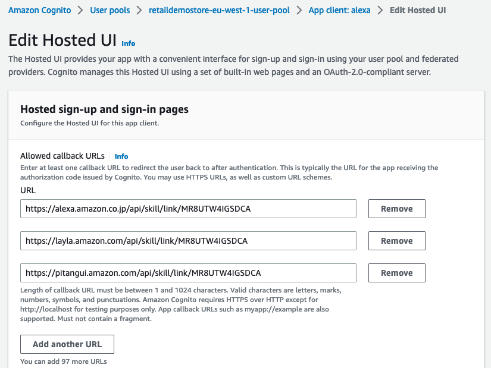

# Location-aware Hands-free Ordering Alexa Skill

## Skill summary

The Retail Demo Store comes with an [Amazon Alexa](https://developer.amazon.com/en-US/alexa) skill that enables voice 
search for nearby stores powered by [Amazon Location Service](https://aws.amazon.com/location/) and hands-free ordering, along with optional recommendations by
 [Amazon Personalize](https://aws.amazon.com/personalize/), and a flow simulating pick-up at the nearby 
 convenience store (c-store). Users are authenticated with Retail Demo Store using
 [Amazon Cognito](https://aws.amazon.com/cognito/).
 
Frictionless shopping based on location makes sense because shoppers are already near the pick-up site. 
Returns or cancellations are likely to be much rarer, and even though their order is typically
ready when they arrive, shoppers also have the opportunity to participate in the in-store experience. 
 
The user experience we will enable through this workshop is as follows:

1. The Alexa user opens the Store Demo in Alexa with the skill invocation name "Retail Demo Store".
2. The Alexa user may now search for a nearby convenience store using Amazon Location Service
   (user location is mocked for this demo). Note that this step could be merged into step 1.
3. The Alexa user is then given the opportunity to order products from  a list of products pulled from the Retail Demo Store products catalogue.
4. A recommended extra purchase is proposed using the Retail Demo Store built-in recommendations system. 
   Amazon Personalize has learnt from the data what products tend to go well together.
5. Depending on whether Cognito/Alexa account linking has been set up AND the user has logged in via account linking:
    1. If account linking is set up, the user's email address will be retrieved.
    2. Otherwise, a default email address will be retrieved from the default CloudFormation parameters of the Retail Demo Store. 
6. The user's order will be registered as an order in Retail Demo Store
7. If an Amazon PinPoint email channel has been setup, an order confirmation will be sent.

For more details about how this skill works, check:
 - The relevant Amazon Developer Alexa [docs](https://developer.amazon.com/en-US/docs/alexa/ask-overviews/what-is-the-alexa-skills-kit.html). In particular:
    - The concepts of [hosting a custom skill with an AWS Lambda function endpoint](https://developer.amazon.com/en-US/docs/alexa/custom-skills/host-a-custom-skill-as-an-aws-lambda-function.html).
    - What is meant by [intents, slots, and dialogs](https://developer.amazon.com/en-US/docs/alexa/custom-skills/create-and-edit-custom-slot-types.html).
 - The interaction model in this repository [src/alexa/skill-package/custom/en-US.json](../../src/alexa/skill-package/custom/en-US.json) shows the slots and intents the skill is configured to handle.
 - The AWS Lambda handling function in this repository [src/aws-lambda/alexa-skill-lambda/alexa-skill-lambda.py](../../src/aws-lambda/alexa-skill-lambda/alexa-skill-lambda.py) is the code used for handling the back-end for the skill.

Note that there are several levels to this experience depending on how much setup is done:

1. You may set up the Alexa skill and connect it to Retail Demo Store to get location search, product search and recommendations.
   **Note**: the recommendations will only work well if the Personalize resources are deployed 
   using the built-in Lambda by selecting the "Auto-Build Personalize Campaigns" parameter in the Retail Demo Store
   CloudFormation: there is no workshop for training Amazon Personalize on realistic c-store customer interactions.
2. You may set up Cognito/Alexa account linking to enable user details to be retrieved by the the Alexa skill.
3. Configure Amazon Pinpoint to enable order confirmation emails. 

How to enable each of these capabilities is discussed in the next sections.

# Deployment Instructions

The following instructions detail the deployment steps required to deploy the Alexa Skill which integrates with 
the Retail Demo Store back-end. 

## Skill Deployment

### High-level concepts

1. You will first create an Alexa Skill in your Amazon Developer account. This skill will initially not have an endpoint set up 
   for handling its back-end logic.
2. You will update the Retail Demo Store CloudFormation template with the Skill ID, which will deploy the Alexa skill backend AWS Lambda function with permissions configured to allow the Alexa Skill to call it.
3. You will retrieve the Arn of the newly deployed Lambda function and configure your Alexa Skill to use it.

### Pre-Requisites

These instructions assume that the Retail Demo Store has been deployed 
 using CloudFormation in an AWS account for which you have CLI access configured. 
 You will need to access the CloudFormation stack you created in the AWS Console UI
 to be able to configure Alexa to work with the Retail Demo Store.

### Step-by-step

The following instructions can be run from within a SageMaker, Cloud9 or local terminal session.

When you deployed Retail Demo Store, a SageMaker notebook was created for you 
in the same region that you deployed Retail Demo Store. We recommend you make use of this. 
To start working in the SageMaker notebook, navigate to 
"[SageMaker Notebook Instances](https://console.aws.amazon.com/sagemaker/home#/notebook-instances)"
Choose your Notebook instance (this will have been deployed for you if you have already deployed
Retail Demo Store into your account). Now, click "Open Jupyter" > "New" > "Terminal". 

1. Obtain the Retail Demo Store repository.
 
   - If you are using the SageMaker notebook server deployed by the Retail Demo Store, the repository will already be 
     available. As your first command type `cd SageMaker` so that any files you work with are 
     visible to the Jupyter editor.
   - Otherwise, to get the repository available locally, or in your SageMaker or Cloud9 instance, run:
  `git clone git@github.com:aws-samples/retail-demo-store.git`
  If you are using a different repository the URL may be different and, if it is a private repository, you may need
  to enter your credentials. 
  
2. Change into the respoitory folder:

    `cd retail-demo-store`
  
3. Change into the Alex folder in the repository:

    `cd src/alexa`
  
4. Install the ASK (Amazon Skills Kit) CLI tool
    - Ensure Node.JS is installed - see [here](https://nodejs.org/en/download/). This is already done for you in
      SageMaker and Cloud9.
    - In a terminal, run `npm install -g ask-cli` to install the Amazon Alexa CLI tool.
      Full instructions available [here](https://developer.amazon.com/en-US/docs/alexa/smapi/quick-start-alexa-skills-kit-command-line-interface.html).

5. Create an [Amazon developer account](https://developer.amazon.com/dashboard) to which you are going to deploy your skill.

6. Configure ASK CLI with the following options:
    - In a terminal, enter `ask configure --no-browser`
    - A URL will be presented that you can enter into a browser so that you can log in to your Amazon Developer account
      and obtain an authorisation token that you can enter into the CLI.    
    - Answer **n** (*no*) to the question 
      `Do you want to link your AWS account in order to host your Alexa skills? (Y/n)` 
      as we will link the to the account containing Retail Demo Store ourselves below.
     
7. Run `cp template.skill.json skill-package/skill.json` to copy the skill definition into the deployment package 
  (you will later overwrite the endpoint configuration in there to point at the endpoint Lambda deployed in the 
  retail demo store). 
   
8. Still in the `src/alexa/` directory, initialize the Alexa Skill with the following command:
    - In a terminal, enter `ask init` and provide the following answers:
        - `Skill Id (leave empty to create one):` <- Leave empty
        - `Skill package path:  (./skill-package)` . <- Leave default: skill-package
        - `Lambda code path for default region (leave empty to not deploy Lambda):` <- Make this blank by pressing backspace
        - `Does this look correct?  (Y/n)` Y

9. Your output from the previous step should appear as follows:
    ```
    ? Skill Id (leave empty to create one):
    ? Skill package path: ./skill-package
    ? Lambda code path for default region (leave empty to not deploy Lambda):
    ```

10. Now you can deploy the skill (but it won't work for testing yet because you have not yet set up the back-end -
    you are deploying the interaction model only):
    ```
    ask deploy --target skill-metadata
    ```
   The Skill ID will be printed on the console. You can also retrieve it from your 
   [Alexa developer console](https://developer.amazon.com/alexa/console/ask) as shown below:

   

11. We are going to enter this skill ID into your Retail Demo Store CloudFormation template,
    so that it can deploy the AWS Lambda function that serves as the skill back-end.
    - Go to your AWS CloudFormation Console and open the Retail Demo Store stack.  Make sure you select the root stack, usually named "retaildemostore", and not any of the nested stacks. 
    - Click "Update" > "Use current template". Then click "Next"
    - Enter the
    following parameters: 
      - Under "*ID of C-Store Demo Alexa skill to access Retail Demo Store*", enter the Skill ID you retrieved in the 
      previous step. 

            
      - You can also enter an email address under 
      "An email to test Alexa integration in case you have not set up Cognito authorisation to link your 
      Retail Demo Store account"
      so that you will receive emails while testing until you can set up Cognito integration.
    - Click "Next" > "Next", ensuring to check the checkboxes "I acknowledge that...",
    then click "Update stack". 
    - CloudFormation will now update the stack and deploy the endpoint for handling
    the back-end functions for this skill, as well as permissions allowing the skill to invoke the
    endpoint. 
    - Wait for the stack to enter `UPDATE_COMPLETE` state. You may have to click the update
    view icon to see the latest state of the stack.

12. Now we need to connect the Alexa Skill to the Lambda endpoint. 

   - Ensure the CloudFormation operation is complete.
   - In the AWS CloudFormation Console, select the Retail Demo Store root stack, then click on the "Outputs" tab.
   - Search for the key: `AlexaSkillEndpointArn` and copy the value. 
      - If it is set to "NotDeployed", something has gone wrong -
    check the previous steps. Otherwise, its value should be of the form
    `arn:aws:lambda:REGION:ACCOUNT:function:STACK-Alexa-XYZ-AlexaSkillFunction-ABC`
    
13. Go back to your repository (e.g. in your Sagemaker notebook instance).  
   - Inside the `src/alexa` folder there is a subfolder called `skill-package`
    into which you created a `skill.json` file in a previous step. 
   - Update the "`apis`" key in that `skill.json`
    file so that the endpoint is set to the Lambda Arn you obtained above. The "`apis`" section in the 
    JSON should end up having the form: 
      ```
      "apis": {
         "custom": {
            "endpoint": {
               "uri": "arn:aws:lambda:REGION:ACCOUNT:function:STACK-Alexa-XYZ-AlexaSkillFunction-ABC"
            }
         }
      },
      ```
14. Now re-deploy the skill, so that the endpoint is configured on the skill:
    ```
    ask deploy --target skill-metadata
    ```    
    You should see "*Skill package deployed successfully.*"
    
Your skill should be ready to test!

### Testing the Skill.

You should be able to test your skill on the "Test" tab of the Skill page in your 
[Amazon Alexa developer console](https://developer.amazon.com/alexa/console/ask).
Switch "Skill testing is enabled in" from "Off" to "Development".

Try saying:

1. "Retail Demo Store". Alexa should prompt you to ask for your nearest convenience store.
2. Then: "Nearest store". Alexa should report its address and distance, and prompt you to order.
3. Answer "Yes", then when asked what you would like to buy, say: "Pizza". Alexa should add it to your shopping cart and prompt an extra product.
4. You can continue adding products to your basket.

You can say "checkout" at any time to submit your order. 

### Debugging the Skill.

You can find logs for the skill back-end.

Go to the Lambda Dashboard and select 'Functions'.  Search for the Alexa skill function by typing "Alexa" into the filter.
Select the Lambda function which has the naming convention:
```
{stack name}-Alexa-{[A-Za-z0-9]+}-AlexaSkillFunction-{[A-Za-z0-9]+}
```
e.g. ```retaildemostore-Alexa-C7A4AAA5A-AlexaSkillFunction-FyAAAAAAF2mm```
This will take you to to the Lambda function configuration.

From there, click "Monitor" > "View Logs in CloudWatch".

## Cognito Authentication Setup

### High-level concepts

For the Alexa Skill to fully integrate with the Demo Store backend and obtain the email address and other
details of a particular Retail Demo Store user, the user of the Alexa Skill needs to be able to authenticate
with the Retail Demo Store backend. This guide will show you how to do manual configuration 
via changes to the Cognito User Pool deployed in the Demo Store CloudFormation stack and to the Alexa app.

The user flow is roughly:

1. User selects within the Alexa app to link their account.
2. Alexa redirects to the custom login hosted by Cognito.
3. The user logs in and is redirected back to Alexa with an authorization code.
4. Alexa uses the authorization code to obtain an access token from Cognito.
5. This token is sent to the back-end and can be used for accessing user details
  from Cognito. The token has permissions boundaries determined when setting up
  the Cognito interface. 
6. Now the back-end can use the user's email for sending them emails and
   adding orders.  
     
These instructions are based on the blog 
[Amazon Cognito for Alexa Skills User Management](https://aws.amazon.com/blogs/compute/amazon-cognito-for-alexa-skills-user-management/).

### Pre-Requisites

These instructions assume that the Alexa skill has been deployed as per *Alexa Skill Deployment Instructions*
section above.

### Step-by-step Cognito setup

We suggest you use a text editor to keep track of the configuration as you generate it. You are instructed as to which details to keep.

1. Go to the Amazon Cognito console, select User pools and then select the Cognito User Pool created by the Retail Demo Store stack.  It should have a naming convention: 
   `{stack name}-{region}-user-pool`
e.g ***retaildemostore-eu-west-1-user-pool***. 
   
2. 
   Select the 'App integration' tab
   
   Then scroll down to 'App clients and analytics' and select ***Create app client***
   

3. Select 'Confidential client' and enter ***alexa*** as the App client name.
   
   - Click **"Create app client"** to create the app client.
   - Once created, select the newly created app client
   - Take note of both the ***Client ID*** and ***Client secret*** as
     these will be needed to set up authentication in Alexa.
      -  To reveal the Client secret, click on the 'Show client secret' toggle.
  
4. Next, go back to the retail demo store user pool and select 'App integration' tab. Within the  Domain section, click on the Actions menu and select ***Create Cognito domain***.

   

5. Create an Amazon Cognito Domain by choosing an available subdomain name and saving your changes.
   In the displayed example the name ```alexa-retail-demo-store``` has been chosen.
    
   

6. Take note of the Cognito domain (in the example it is `https://alexa-retail-demo-store.auth.eu-west-1.amazoncognito.com`).

7. Now go to your [Alexa developer account](https://developer.amazon.com/alexa/console/ask) and open the Skill. 
   In the 'Build' tab select 'Account Linking' under 'Tools'.
   
   

8. Select the option to allow users to link accounts:

   
   
   Leave the default option for 'Auth Code Grant' selected then fill out the following values:
   
   - The 'Web Authorization URI' takes the following form: 
     `{Cognito Domain}/oauth2/authorize?response_type=code&redirect_uri=https://pitangui.amazon.com/api/skill/link/{Vendor ID}`.
      - The Cognito domain should match the one defined above. 
      - The Vendor ID can be found as the final piece of information in the 'Alexa Redirect URLs' at the bottom of the
      present Alexa Account Linking page (in the below image this is `MR8UTW4IGSDCA`).  
      - After substituting the values it should look something like: `https://alexa-retail-demo-store.auth.eu-west-1.amazoncognito.com/oauth2/authorize?response_type=code&redirect_uri=https://pitangui.amazon.com/api/skill/link/MR8UTW4IGSDCA`

   - Take note of all the Alexa Redirect Url's, as these will be needed for the Allowed callback URLs in the Cognito Hosted UI setup
      
       
   - The 'Access Token URI' takes the following form: `{Cognito Domain}/oauth2/token`, 
     with the Cognito Domain populated as in the URI above. 
   - Enter 'Your Client ID' and 'Your Secret' values using the values you noted above from creating the Cognito app client.
   
     
   - Leave the remaining values on the page as default, and hit the 'Save' button (this may be at the top of the page).
    
9. Return to the AWS Console and the Cognito User Pool UI, and select the 'retail demo store' user pool.  Go to the 'App clients and analytics' section under the 'App Integration' tab and select the 'alexa' client created previously (<span style="color:red">note: there will be 
   another app client in the list that handles the Retail Demo Store UI authentication - be careful not to work with that one by mistake</span>).
   - Scroll down to the ***Hosted UI*** section and click ***Edit***.
    
    - Under 'Hosted sign-up and sign-in pages' go to the Allowed callback URLs section.
    - Add 'Callback URLs' for the three 'Alexa Redirect URLs' from the Alexa Account Linking page:
      
    - Add a 'Sign out URL' with the following format: ``` {Cognito Domain}/logout?response_type=code ``` 
      For example: `https://alexa-retail-demo-store.auth.eu-west-1.amazoncognito.com/logout?response_type=code`
    - Under 'Allowed OAuth Flows', select 'Authorization code grant'
    - Under 'Allowed OAuth Scopes', select 'phone', 'email', 'openid' and 'profile'.
    
    - Save these changes. It should now be possible to click the 'Launch Hosted UI' button below this form, 
      at which point you should see a functioning sign-in page where users that have been created with the Retail
      Demo Store UI can be logged in and get a "Linking successful" message. 
      If not, go back and check the previous steps.

10. Finally, go to the Lambda dashboard and select the `AlexaSkillFunction` (You can search for the function by typing 'alexa' into the search filter).
    Select the Configuration tab, choose Environment Variables, and click Edit.
    Click on the 'Add environment variable' and enter:
    - Key: COGNITO_DOMAIN
    - Value: {Cognito Domain}

   
    This configures the Lambda skill back-end endpoint with the Cognito domain.  Ensure there is no trailing slash when entering the Cognito Domain

11. Your Alexa Skill should now be ready for full usage with account linking to the Demo Store back-end. 
    Testing is best done using the Alexa mobile app.
    Browse to [https://alexa.amazon.com](https://alexa.amazon.com), on your mobile to install or open the Alexa app.
    - Go to: "More" > "Skills & Games" > "Your Skills" > "Dev" 
    - Select the "Retail Demo Store" skill
    - Select "Account Linking" > "Link Account"
    and enter the login details of a user you have previously created using the Retail Demo Store UI. 
    - This is what a successful linking should look like:

    

12. When you launch the Retail Demo Store skill through your Alexa device and attempt to checkout, you will hear the message:
    "Hope to see you again soon {profile name}" rather than "Thanks for playing!". 
    Orders will be entered against the user and emails sent to the user by Retail Demo Store.

## Testing & Usage

Using your Alexa device: 

Start the demo with this phrase:

           "Alexa, open Retail Demo Store" 

followed by: 

            “Where is the nearest store” 

**Note**: <span style="color:red">The Skill can only be tested on an Alexa-enabled device (including the mobile app) 
          if the device locale _exactly_ matches that of the Skill (English US).</span>
          This can be set in "Device Settings" on your Alexa device.   

## Pinpoint e-mail channel setup

### High-level concepts
Amazon Pinpint helps you engage with your customers by sending email, SMS, and push notification messages.  
The Retail Demo Store doesn't send an order confirmation email as part of the order service.  
Therefore, we can show how this can be implemented in our Alexa Skill Lambda function by integrating with Pinpoint.
The code is already integrated, all that is left to do is set-up an [email channel](https://docs.aws.amazon.com/pinpoint/latest/userguide/channels-email.html) within Amazon Pinpoint.

### Step-by-step Pinpoint setup
The instructions to setup a Pinpoint e-mail channel can be found within the [Pinpoint workshop](../4-Messaging/4.1-Pinpoint.ipynb) in the section "Enable Pinpoint Email Channel"

Once this has been completed, each time you checkout through the Alexa skill, an order confirmation email should be sent to the email address of the Retail Demo Store user setup through account linking.

# Deletion & Cleanup

Before deleting the Demo Store CloudFormation stack, the Cognito domain & App Client created 
in the **Cognito Authentication Setup** section must be manually deleted.

Resources owned by Retail Demo Store will be removed when the Retail Demo Store CloudFormation stack is removed - 
if you set the Alexa Skill ID and sandbox email parameters to empty and Update the stack, the backend Lambda will also
be removed.

You can remove your skill at [the Alexa developer UI](https://developer.amazon.com/alexa/console/ask).
Or, run 

    ask smapi delete-skill -s SKILLID  # changing SKILLID for your skill

   